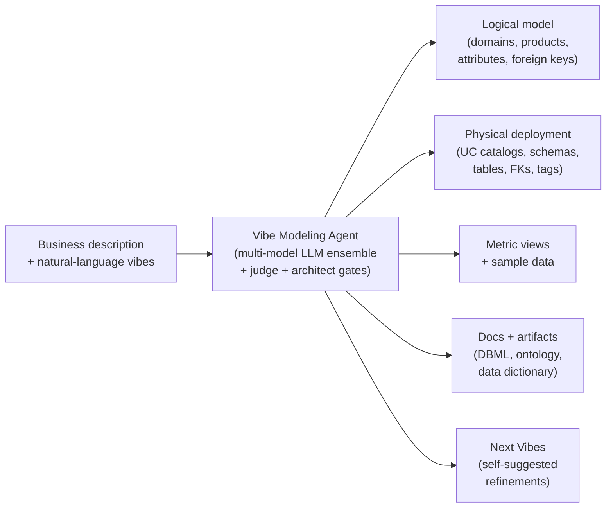

# Vibe Data Modeling

### Describe your business in plain English. Get a governed, Unity-Catalog-ready data model on Databricks — in hours, not months.

This repository is a complete, Databricks-native **data-modeling system** built around one thing: an AI agent that turns a plain-English description of a business into a production-ready Silver-layer data model — schemas, foreign keys, metric views, governance tags, an ontology, and diagrams — and lets you refine it, in natural language, until it fits.

**The agent is the point.** The 40 industries and 80 models in this repo were all produced by that one agent — they are a *demonstration gallery*, not the product. What matters is that you can point the agent at *your* business and get the same thing, in your terminology, in an afternoon.

> **⚡ The 30-second version:** [`model-agent/`](./model-agent/) is the agent — a "vibe" in, a governed model out. [`model-genie-skills/`](./model-genie-skills/) is the process that forms a generated model onto your *real* data. [`model-viewer/`](./model-viewer/) is a Databricks App that renders any model as an interactive graph. Everything under [`data-models/`](./data-models/) is what the agent built when we ran it across 40 industries.

**[▶ Open the interactive gallery](https://databricks-industry-solutions.github.io/lakehouse-industry-data-models/)** — explore the agent's output as browsable ER graphs.


---

## What's in this repo

Four parts, agent first. The first three are the *system*; the fourth is what the system produced.

| # | Part | Folder | What it is |
|---|---|---|---|
| **1** | **The agent** | [`model-agent/`](./model-agent/) | **The core.** An LLM-powered, Databricks-native agent that turns a business description + natural-language "vibes" into a governed Silver-layer model deployed to Unity Catalog. Iterate in plain English; every vibe produces a new, validated, versioned model. |
| **2** | **The process** | [`model-genie-skills/`](./model-genie-skills/) | The toolchain that takes a generated model and **forms it to a customer's real data** — a phase-gated **assess → build → validate → document** loop, one domain at a time. |
| **3** | **The app + installer** | [`model-viewer/`](./model-viewer/) · [`model-installer/`](./model-installer/) | A **Databricks App** that renders any model as an interactive entity-relationship graph, and a notebook that deploys any model into Unity Catalog (optionally with referentially-correct sample data). |
| **4** | **The example models** | [`data-models/`](./data-models/) | **The demonstration.** 40 industries × 2 flavours = 80 models the agent generated, published as browsable reference material. Proof of what the agent does at scale — [jump to the gallery ↓](#the-example-gallery--what-one-agent-produced). |

---

## 1 · The agent — the point

**Getting a Silver-layer model has always been the hard part.** Most organizations either spend six months to three years hand-building one, or buy a generic industry template (ACORD, FHIR, ARTS, TM Forum SID) and then spend nine to twelve months trimming and rewiring it — a template is the average of a whole sector, so by construction it is nobody's actual business.

The **Vibe Data Modeling agent** replaces that with a single Databricks notebook. Describe your business, run it, and get a complete, governed, deployable model. Don't like what came out? You "vibe" it in plain English until it fits.

- **Hours, not months** — a Minimum Viable Model in under two hours; a full Expanded Coverage Model in a single afternoon.
- **100% relevant to you** — your terminology, your divisions, your domains — not a sector average.
- **Trustworthy by construction** — enforceable rules, two architect-persona reviews, and a closed agentic loop that *proves* the model before it ships. The quality score is computed from the model itself, not from an LLM's self-assessment.
- **Native Unity Catalog deployment** — schemas, tables, foreign keys, classification tags, metric views, an RDFS ontology, a DBML diagram, and sample data, generated and versioned together.



Under the hood it runs a multi-model ensemble across an eight-stage pipeline, with deterministic structural validators gating every stage and a monotonic guard that reverts any pass that makes the model worse. One principle governs the whole thing: **user vibes are the supreme authority** — an explicit instruction outranks every heuristic, score, and LLM opinion in the pipeline.

**→ Full details, run instructions, the rule catalog, and the whitepaper: [`model-agent/readme.md`](./model-agent/readme.md).**

**Learn more:** [Reimagining Data Modeling on the Lakehouse: Introducing Vibe Data Modeling](https://www.databricks.com/blog/reimagining-data-modeling-lakehouse-introducing-vibe-data-modeling) · [Jumpstart your Data Modeling with Databricks Industry Data Models](https://www.databricks.com/blog/jumpstart-your-data-modeling-databricks-industry-data-models).

---

## 2 · The process — from reference model to *your* real data

A generated model describes *what good looks like* — a coherent, documented target shape. Getting there against a customer's real data is the next step, and that is what [**`model-genie-skills/`**](./model-genie-skills/) provides: a suite of **Genie Code skills** that form a generated model onto real data on Databricks, one domain at a time, through a disciplined, phase-gated loop with a human at the decision points.

Handoff between stations happens through **documents, not chat** — discovery runs once, and everything downstream inherits it:

| Station | Skill | What it does |
|---|---|---|
| **Assess** | `domain-model-assessment` | Profiles bronze, folds in existing production silver/gold, and produces a source-to-target mapping, a gap registry, and Full/Partial/Blocked fit grades — then emits pre-filled handoff docs for the build. |
| **Build** | `etl-development-framework` | Turns the assessment into pipelines to the customer's naming + engineering standards: DDL (PK/FK/CHECK/comments), Type-1 MERGE notebooks (or a Lakeflow Declarative Pipeline), a DQ validation notebook, and a deployable job. |
| **Validate** | `domain-model-validation` | Proves the load landed as intended (0 FK orphans, 0 dropped rows, no silent nulls) with per-table narrative + regression notebooks, a scorecard, and a quality dashboard. |
| **Document** | `domain-documentation` | Diátaxis docs, a Model Guide entry-point notebook, and an auto-generated **Genie space** so the domain is queryable in natural language the moment it's built. |

`autonomous-validation` governs execution discipline throughout (scratchpad-validate → confirm → persist, with a human at each gate), and `domain-sync` keeps a built model's artifacts in sync after point updates.

**→ Full walkthrough: [`model-genie-skills/README.md`](./model-genie-skills/README.md)** · or the [developer docs index](./model-genie-skills/docs/developer/index.md).

---

## 3 · The app — explore any model as an interactive graph

The fastest way to explore a model visually is the **model-viewer app**, a **Databricks App** that renders any `model.json` as an interactive entity-relationship graph with three navigable views.

**Install it** with the notebook [`model-viewer/model_viewer_app_installer.ipynb`](./model-viewer/model_viewer_app_installer.ipynb) — import it into your workspace and run all cells; it provisions the App and prints its URL. Then load any model by pasting a repo path, or by uploading a `model.json` directly.

| View | What you see |
|---|---|
| **Full-model overview** | Every entity on one canvas, every foreign key drawn, domains colour-coded.  |
| **Domain drill-down** | Click a domain to zoom into its sub-domains and products, FK web restricted to within-domain links.  |
| **Single-product radial** | Click a product to centre it; every related product fans out by domain, showing every join path.  |

**ERD view** — **Toggle ERD View** in the toolbar redraws the same model as a classic entity-relationship diagram: every entity a card listing its columns with `PK` and `FK` markers and the declared type, and every foreign key drawn as an orthogonal connector routed around the cards rather than across them, with a crow's foot at the many end. A card shows its first six columns plus every key and reference; **Show N more columns** opens the rest. Clicking a card or a connector fills the details panel exactly as clicking a node in the graph does, and the toolbar's zoom controls scale the diagram, so the two views stay interchangeable — the graph for shape and scale, the ERD for reading columns and join keys.

**Core entities** narrows a large model to the most connected fifth of its entities (at least twelve) and the relationships between them, which is usually the readable starting point on a full ECM. The ERD also honours wherever you have navigated to: drill into a domain and switch to ERD and you get an ERD of that domain, and clicking a single entity centres it with everything it references around it.


### Deploying a model into Unity Catalog

The **[`model-installer/data-model-installer.ipynb`](./model-installer/data-model-installer.ipynb)** notebook installs any model — catalog, schemas, tables, foreign keys, governance tags, and metric views — with a single `Run All`. It is Databricks Serverless compatible, resolves the latest version of a model automatically, and can render the same logical model as one catalog, a catalog per division, or a catalog per domain.

**Sample data, by construction.** Set `generate_samples` to `Yes` and the installer fills every table with referentially-correct synthetic rows — unique primary keys, every foreign key resolving to a real parent, nothing landing half-broken (an integrity gate re-checks in memory before the first write), and reproducible reruns from a fixed seed. Verified end-to-end against `information_schema` on live installs:

| Install | Tables | Rows | Duplicate PKs | Foreign keys checked | Orphans |
|---|---:|---:|---:|---:|---:|
| `restaurants` MVM @ 10 rows | 87 | 870 | 0 | 506 (338 cross-domain) | **0** |
| `banking` MVM @ 100 rows | 227 | 22,700 | 0 | 2,478 (2,002 cross-domain) | **0** |
| `pc_insurance` ECM @ 10 rows | 226 | 2,260 | 0 | 1,271 (794 cross-domain) | **0** |
| `pc_insurance` MVM @ 10 rows | 120 | 1,200 | 0 | 994 (722 cross-domain) | **0** |

**→ Full installer reference — every widget, phase, and guarantee — is documented in the notebook's first cell.**

---

## The example gallery — what one agent produced

Everything below is the **demonstration**: the models the agent generated when we pointed it at 40 industries. Read the numbers as a statement about the *agent* — one industry-agnostic engine produced all of it, every model passing the same structural gates.

**40 industries · 80 models · 23,092 tables · 885,842 attributes · 156,641 foreign keys · 11,661 metric views — zero FK cycles, zero dangling foreign keys across all 80.**

Each industry ships in **two flavours** of the same business domain:

- **`ecm/` — Expanded Coverage Model.** Comprehensive, audit-grade — the agent's source of truth. Covers every entity it can think of for the industry.
- **`mvm/` — Minimum Viable Model.** Production-ready, demo-friendly subset (~40% of the ECM's tables), retaining the most-used entities and FK paths. Recommended starting point.

### At a glance

| Metric | ECM | MVM | Combined |
|---|---:|---:|---:|
| Industries shipped | 40 | 40 | **40 / 40** |
| Models published | 40 | 40 | **80** |
| Domains | 722 | 524 | 1,246 |
| Sub-domains | 2,554 | 1,414 | 3,968 |
| Tables / data products | 16,592 | 6,500 | **23,092** |
| Attributes / columns | 615,764 | 270,078 | **885,842** |
| Foreign-key relationships | 98,709 | 57,932 | **156,641** |
| Metric views (BI-ready) | 7,307 | 4,354 | **11,661** |
| Distinct governance tags | 963 | 679 | 1,642 |

### Quality gates — every model passes

Every shipped model was validated against the agent's model-level integrity contract. The MVMs are entirely structurally clean.

| Check | ECM (40 models) | MVM (40 models) |
|---|---:|---:|
| FK cycles (graph SCC) | 0 | 0 |
| Bidirectional FK pairs | 0 | 0 |
| Dangling FKs (target product missing) | 0 | 0 |
| Self-FKs on primary keys | 0 | 0 |
| Siloed tables (no FK in or out) | 15 (across 11 ECMs) | 0 |
| Cross-domain duplicate product names | 34 (across 18 ECMs) | 0 |
| Fidelity gates (Memory/JSON precision ≥ 0.85) | PASSED | PASSED |
| Per-version readme present | 40 / 40 | 40 / 40 |

All 40 MVMs ship with **zero structural findings**. The 15 ECM silos and 34 ECM cross-domain name overlaps are the only outstanding items — all minor, all called out in [Known limitations](#known-limitations).

### Industry index

Click an industry to open its folder. The installer resolves the highest version present.

> **Property & Casualty Insurance** is the 41st industry, added after the original gallery run (from [issue #42](https://github.com/databricks-industry-solutions/lakehouse-industry-data-models/issues/42)). It ships both ECM and MVM. **v2** refines v1 through vibe-modeling-of-version: the `claims`, `risk_exposure`, and `catastrophe_geography` domains are renamed to `claim`, `risk`, and `catastrophe`, `claim_financials` folds into `claim` as a subdomain, and the underwriting lifecycle (23 products: submission, clearance, eligibility, rating, quoting, binding, and decisioning) is rebalanced from `coverage` into `underwriting` so `underwriting` holds 24 products and `coverage` 22 (v1 remains selectable in the viewer). The aggregate totals above still describe the original **40 industries / 80 models** (P&C is counted separately); the index below lists all 41.

<details>
<summary><b>Financial Services &amp; Insurance</b></summary>

| Industry | Version | ECM Tables | MVM Tables |
|---|---|---:|---:|
| [Banking](./data-models/banking/) | v1 | [501](./data-models/banking/v1/ecm/) | [227](./data-models/banking/v1/mvm/) |
| [Payments & Fintech](./data-models/payments_fintech/) | v1 | [546](./data-models/payments_fintech/v1/ecm/) | [223](./data-models/payments_fintech/v1/mvm/) |
| [Health Insurance](./data-models/health_insurance/) | v2 | [411](./data-models/health_insurance/v2/ecm/) | [130](./data-models/health_insurance/v2/mvm/) |
| [Life Insurance](./data-models/life_insurance/) | v1 | [468](./data-models/life_insurance/v1/ecm/) | [217](./data-models/life_insurance/v1/mvm/) |
| [Property & Casualty Insurance](./data-models/pc_insurance/) | v2 | [226](./data-models/pc_insurance/v2/ecm/) | [90](./data-models/pc_insurance/v2/mvm/) |

</details>

<details>
<summary><b>Healthcare &amp; Life Sciences</b></summary>

| Industry | Version | ECM Tables | MVM Tables |
|---|---|---:|---:|
| [Healthcare](./data-models/healthcare/) | v2 | [542](./data-models/healthcare/v2/ecm/) | [121](./data-models/healthcare/v2/mvm/) |
| [Pharmaceuticals](./data-models/pharmaceuticals/) | v1 | [441](./data-models/pharmaceuticals/v1/ecm/) | [213](./data-models/pharmaceuticals/v1/mvm/) |
| [Genomics & Biotech](./data-models/genomics_biotech/) | v1 | [403](./data-models/genomics_biotech/v1/ecm/) | [182](./data-models/genomics_biotech/v1/mvm/) |
| [Clinical Trials](./data-models/clinical_trials/) | v1 | [379](./data-models/clinical_trials/v1/ecm/) | [193](./data-models/clinical_trials/v1/mvm/) |

</details>

<details>
<summary><b>Travel &amp; Logistics</b></summary>

| Industry | Version | ECM Tables | MVM Tables |
|---|---|---:|---:|
| [Airlines](./data-models/airlines/) | v1 | [424](./data-models/airlines/v1/ecm/) | [205](./data-models/airlines/v1/mvm/) |
| [Travel & Hospitality](./data-models/travel_hospitality/) | v2 | [353](./data-models/travel_hospitality/v2/ecm/) | [87](./data-models/travel_hospitality/v2/mvm/) |
| [Transport & Shipping](./data-models/transport_shipping/) | v1 | [514](./data-models/transport_shipping/v1/ecm/) | [210](./data-models/transport_shipping/v1/mvm/) |
| [Shipping Ports](./data-models/shipping_ports/) | v2 | [420](./data-models/shipping_ports/v2/ecm/) | [117](./data-models/shipping_ports/v2/mvm/) |

</details>

<details>
<summary><b>Energy &amp; Resources</b></summary>

| Industry | Version | ECM Tables | MVM Tables |
|---|---|---:|---:|
| [Oil & Gas](./data-models/oil_gas/) | v1 | [568](./data-models/oil_gas/v1/ecm/) | [246](./data-models/oil_gas/v1/mvm/) |
| [Energy & Utilities](./data-models/energy_utilities/) | v1 | [451](./data-models/energy_utilities/v1/ecm/) | [236](./data-models/energy_utilities/v1/mvm/) |
| [Mining](./data-models/mining/) | v1 | [416](./data-models/mining/v1/ecm/) | [219](./data-models/mining/v1/mvm/) |
| [Water Utilities](./data-models/water_utilities/) | v2 | [377](./data-models/water_utilities/v2/ecm/) | [103](./data-models/water_utilities/v2/mvm/) |

</details>

<details>
<summary><b>Public Sector &amp; Services</b></summary>

| Industry | Version | ECM Tables | MVM Tables |
|---|---|---:|---:|
| [Education](./data-models/education/) | v1 | [446](./data-models/education/v1/ecm/) | [203](./data-models/education/v1/mvm/) |
| [NGO](./data-models/ngo/) | v2 | [304](./data-models/ngo/v2/ecm/) | [87](./data-models/ngo/v2/mvm/) |
| [Legal](./data-models/legal/) | v1 | [314](./data-models/legal/v1/ecm/) | [153](./data-models/legal/v1/mvm/) |
| [Waste Management](./data-models/waste_management/) | v1 | [471](./data-models/waste_management/v1/ecm/) | [194](./data-models/waste_management/v1/mvm/) |
| [Staffing & HR](./data-models/staffing_hr/) | v1 | [302](./data-models/staffing_hr/v1/ecm/) | [153](./data-models/staffing_hr/v1/mvm/) |
| [Real Estate](./data-models/real_estate/) | v1 | [344](./data-models/real_estate/v1/ecm/) | [177](./data-models/real_estate/v1/mvm/) |

</details>

<details>
<summary><b>Communications, Media &amp; Entertainment</b></summary>

| Industry | Version | ECM Tables | MVM Tables |
|---|---|---:|---:|
| [Telecommunication](./data-models/telecommunication/) | v1 | [451](./data-models/telecommunication/v1/ecm/) | [167](./data-models/telecommunication/v1/mvm/) |
| [Media & Broadcasting](./data-models/media_broadcasting/) | v2 | [425](./data-models/media_broadcasting/v2/ecm/) | [132](./data-models/media_broadcasting/v2/mvm/) |
| [Sports & Entertainment](./data-models/sports_entertainment/) | v1 | [473](./data-models/sports_entertainment/v1/ecm/) | [200](./data-models/sports_entertainment/v1/mvm/) |
| [Gaming](./data-models/gaming/) | v1 | [396](./data-models/gaming/v1/ecm/) | [176](./data-models/gaming/v1/mvm/) |
| [Advertising](./data-models/advertising/) | v1 | [262](./data-models/advertising/v1/ecm/) | [95](./data-models/advertising/v1/mvm/) |

</details>

<details>
<summary><b>Retail &amp; Consumer</b></summary>

| Industry | Version | ECM Tables | MVM Tables |
|---|---|---:|---:|
| [Retail](./data-models/retail/) | v2 | [405](./data-models/retail/v2/ecm/) | [125](./data-models/retail/v2/mvm/) |
| [Grocery](./data-models/grocery/) | v1 | [374](./data-models/grocery/v1/ecm/) | [175](./data-models/grocery/v1/mvm/) |
| [Ecommerce](./data-models/ecommerce/) | v1 | [369](./data-models/ecommerce/v1/ecm/) | [148](./data-models/ecommerce/v1/mvm/) |
| [Consumer Goods](./data-models/consumer_goods/) | v2 | [405](./data-models/consumer_goods/v2/ecm/) | [116](./data-models/consumer_goods/v2/mvm/) |
| [Apparel & Fashion](./data-models/apparel_fashion/) | v1 | [400](./data-models/apparel_fashion/v1/ecm/) | [163](./data-models/apparel_fashion/v1/mvm/) |
| [Food & Beverage](./data-models/food_beverage/) | v1 | [376](./data-models/food_beverage/v1/ecm/) | [157](./data-models/food_beverage/v1/mvm/) |
| [Restaurants](./data-models/restaurants/) | v2 | [293](./data-models/restaurants/v2/ecm/) | [87](./data-models/restaurants/v2/mvm/) |

</details>

<details>
<summary><b>Manufacturing &amp; Industrial</b></summary>

| Industry | Version | ECM Tables | MVM Tables |
|---|---|---:|---:|
| [Manufacturing](./data-models/manufacturing/) | v2 | [414](./data-models/manufacturing/v2/ecm/) | [114](./data-models/manufacturing/v2/mvm/) |
| [Chemical Manufacturing](./data-models/chemical_mfg/) | v1 | [405](./data-models/chemical_mfg/v1/ecm/) | [202](./data-models/chemical_mfg/v1/mvm/) |
| [Semiconductors](./data-models/semiconductors/) | v2 | [386](./data-models/semiconductors/v2/ecm/) | [113](./data-models/semiconductors/v2/mvm/) |
| [Automotive](./data-models/automotive/) | v2 | [590](./data-models/automotive/v2/ecm/) | [114](./data-models/automotive/v2/mvm/) |
| [Construction](./data-models/construction/) | v2 | [365](./data-models/construction/v2/ecm/) | [143](./data-models/construction/v2/mvm/) |
| [Agriculture](./data-models/agriculture/) | v1 | [408](./data-models/agriculture/v1/ecm/) | [177](./data-models/agriculture/v1/mvm/) |

</details>

Twenty-six industries are on `v1`; fourteen have a `v2` produced by a later agent revision. A flat, machine-readable manifest of every model lives at [`data-models/models-info.csv`](./data-models/models-info.csv).

---

## Repository layout

```
├── model-agent/          # 1 · The agent — vibe → governed model (the core)
├── model-genie-skills/   # 2 · The process — form a model onto real data (assess→build→validate→document)
├── model-viewer/         # 3a · The Databricks App — interactive ER graph viewer
├── model-installer/      # 3b · Deploy any model into Unity Catalog (+ sample data)
├── data-models/          # 4 · The example gallery — 40 industries × {ecm, mvm}, the agent's output
├── docs/                 # GitHub Pages interactive gallery
└── tools/                # Repo maintenance helpers (manifest build, viewer sync)
```

Each industry folder holds one or more version siblings; every model derives from a single `model.json`, with per-table DDL, metric-view SQL, ontology, docs, and a DBML diagram generated from it:

```
<industry>/
└── v1/                          # v2/, v3/, … land as siblings
    ├── ecm/
    │   ├── model.json           # single source of truth
    │   ├── schemas/  metrics/  ontology/  docs/  diagram/
    │   └── vibes/next_vibes.txt # agent's self-suggested refinements for the next version
    └── mvm/                      # same structure
```

---

## Known limitations

- **Sample data is synthetic and opt-in.** Keys and foreign keys are correct by construction and gated before the write, so joins and demos behave, but the *values* are invented. Replace with real ingestion (see [the process](#2--the-process--from-reference-model-to-your-real-data)) before production.
- **18 ECMs carry 34 cross-domain duplicate product names** (usually legitimate shared lookups). **All 40 MVMs are clean.**
- **11 ECMs contain 15 siloed products** between them (legitimate top-level reference entities the agent chose not to link out from). **All 40 MVMs are silo-free.**
- **Industry coverage is broad, not deep.** The ECMs aim for 70–80% of an enterprise's domain shape; the last 20–30% (org-specific extensions, third-party integrations) is a follow-up vibe-iteration the agent can take on.

---

## License

These example models are auto-generated and provided as-is for reference. Industry standards evolve; verify against your organisation's specific business rules and regulatory context before production use. See [LICENSE.md](./LICENSE.md), [NOTICE.md](./NOTICE.md), and [SECURITY.md](./SECURITY.md).

---

*One agent · 40 industries · 80 models · 23,092 tables · zero FK cycles, zero dangling foreign keys across all 80. **The models are the demo — [the agent](./model-agent/) is the product.***
