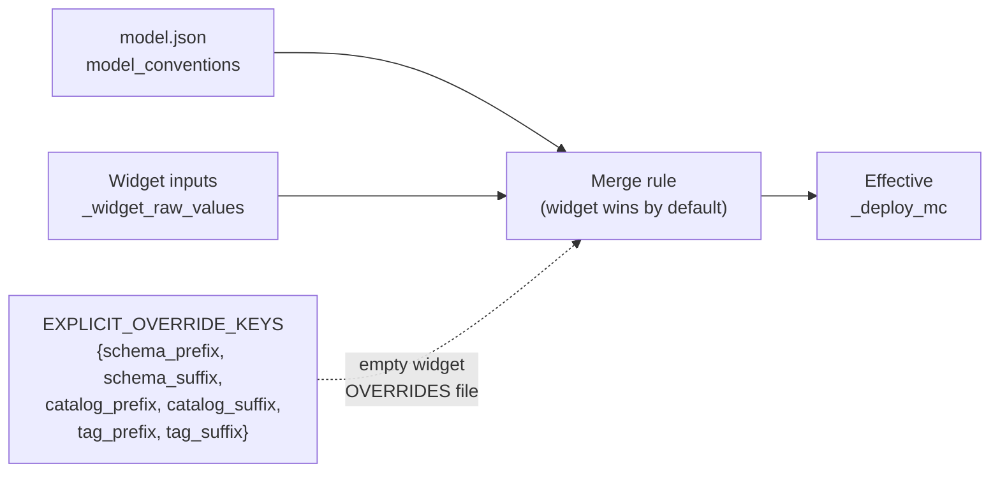
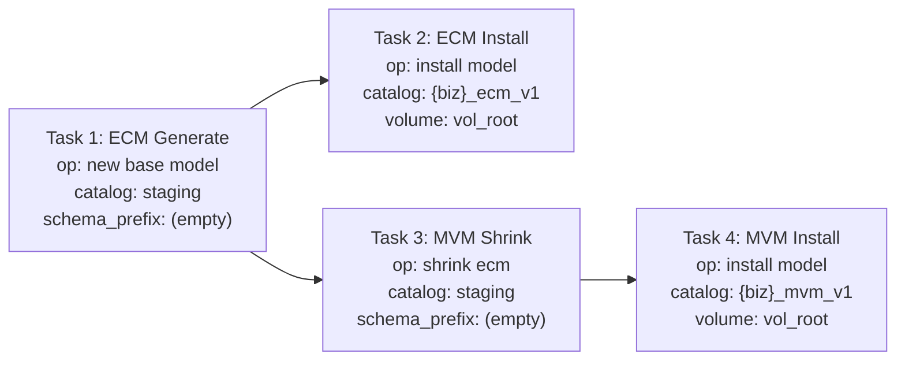
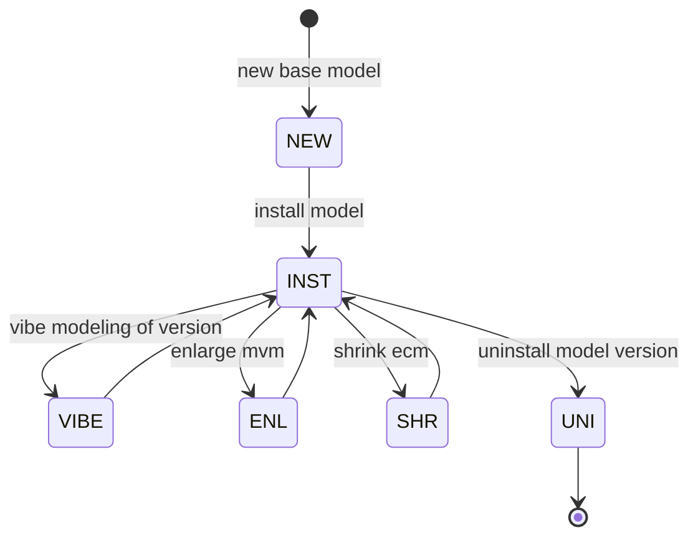

# Vibe Modelling Agent Integration Guide

> Producer-consumer protocol for UIs and downstream consumers to observe and interact with the Vibe Modelling Agent in real time: session handshake, progress events, `result_json` schemas, and SQL reference.

[← Back to project root](../readme.md) · [Design guide](design-guide.md) · [Whitepaper](whitepaper.md)

---

## Table of Contents

- [1. Architecture Overview](#1-architecture-overview)
- [2. How to Launch](#2-how-to-launch)
  - [Mode A — UI Creates the Job (Recommended)](#mode-a--ui-creates-the-job-recommended)
  - [Mode B — Notebook Auto-Launches Itself](#mode-b--notebook-auto-launches-itself)
  - [Launch Flow Diagram](#launch-flow-diagram)
- [3. Tables](#3-tables)
  - [3.1 Business Table (Session Table)](#31-business-table-session-table)
  - [3.2 Progress Table](#32-progress-table)
- [4. Session ID Assignment](#4-session-id-assignment)
- [5. Handshake Protocol (Producer-Consumer)](#5-handshake-protocol-producer-consumer)
- [6. Polling Strategy](#6-polling-strategy)
  - [6.1 Polling the Business Table (Session Status)](#61-polling-the-business-table-session-status)
  - [6.2 Polling the Progress Table (Event Log)](#62-polling-the-progress-table-event-log)
  - [6.3 Detecting Completion](#63-detecting-completion)
  - [6.4 Detecting Errors](#64-detecting-errors)
  - [6.5 Detecting Stale Sessions](#65-detecting-stale-sessions)
- [7. Event Lifecycle](#7-event-lifecycle)
- [8. Complete Stage Reference with result_json Schemas](#8-complete-stage-reference-with-result_json-schemas)
- [9. How the UI Should Build the Model Visually](#9-how-the-ui-should-build-the-model-visually)
- [10. Querying result_json (VARIANT Column)](#10-querying-result_json-variant-column)
- [11. Client Implementation Pseudocode](#11-client-implementation-pseudocode)
- [12. Operational Modes](#12-operational-modes)
- [13. Timing Characteristics](#13-timing-characteristics)
- [14. Edge Cases and Error Handling](#14-edge-cases-and-error-handling)
- [15. SQL Quick Reference](#15-sql-quick-reference)
- [16. Model App Contract](#16-model-app-contract)

---

## 1. Architecture Overview

The Vibe Modelling Agent is a long-running backend pipeline that generates enterprise data models (domains, products, attributes, foreign keys, physical schemas, tags, sample data, and artifacts) using LLMs. It runs as a Databricks notebook job on serverless compute.

The client UI communicates with the agent **exclusively through two Delta Lake tables**. There is no WebSocket, no REST API, and no callback URL. The protocol is a **producer-consumer handshake over database polling**.

```
┌──────────────┐         Delta Lake Tables           ┌──────────────────┐
│              │   ┌──────────────────────────────┐   │                  │
│  Client UI   │──▶│  Business Table (session row) │◀──│  Vibe Modelling  │
│  (Consumer)  │   └──────────────────────────────┘   │  Agent (Producer)│
│              │   ┌──────────────────────────────┐   │                  │
│              │──▶│  _vibe_progress (event log)   │◀──│                  │
│              │   └──────────────────────────────┘   │                  │
└──────────────┘                                      └──────────────────┘
```

**Data flows one way**: the agent writes, the UI reads. The only column the UI writes back is `processing_status` (set to `'done'` after consuming a batch).

**Bookend events**: The very first row in the progress table is always `stage_name = 'Vibe Session'`, `status = 'stage_started'`. The very last row is always `stage_name = 'Vibe Session'`, `status = 'stage_ended'`. Success or error is determined by `result_json.status` (`"success"` or `"pipeline_error"`).

---

## 2. How to Launch

The Vibe Modelling Agent notebook supports two launch modes. The UI app should always use **Mode A** (recommended). Mode B is a fallback that the notebook handles automatically when run interactively without a session ID.

### Mode A — UI Creates the Job (Recommended)

The UI app creates and launches a Databricks job itself, passing all widget values and a pre-generated session ID. This gives the UI full control over the job lifecycle, monitoring, and cancellation.

**Steps:**

1. Generate a `vibe_session_id` string (see Section 4 for format).
2. Collect all widget values the user has configured.
3. Create a Databricks job using the Jobs API with the required tags (see table below).
4. Run the job with `run_now`.
5. Begin polling the Delta tables using the session ID.

**Required Job Tags:**

When the UI creates the job, it **MUST** set these exact tag keys. All values must match the regex `^(([A-Za-z0-9][-A-Za-z0-9_.]*)?[A-Za-z0-9])?$` (alphanumeric start/end, only `A-Za-z0-9`, `-`, `_`, `.` in between, no spaces).

| Tag Key | Value | Example |
|---|---|---|
| `dbx_vibe_modelling_launcher_source` | Source that launched the job: `Vibe_Modelling_Notebook` when launched from a notebook, `Vibe_Modelling_App` when launched from an external app/UI | `Vibe_Modelling_Notebook`, `Vibe_Modelling_App` |
| `dbx_vibe_modelling_business` | Sanitized business name (spaces → `_`, special chars removed) | `gov_transport`, `Acme_Corp` |
| `dbx_vibe_modelling_model` | `{scope}_v{version}` where scope is `mvm` or `ecm` | `mvm_v1`, `ecm_v2` |
| `dbx_vibe_modelling_operation` | Sanitized operation name (spaces → `_`) | `new_base_model`, `vibe_modeling_of_version`, `shrink_ecm`, `enlarge_mvm`, `install_model`, `uninstall_model_version` |
| `dbx_vibe_modelling_domains` | `0` (updated by agent at end of run) | `0` → `8` |
| `dbx_vibe_modelling_products` | `0` (updated by agent at end of run) | `0` → `47` |
| `dbx_vibe_modelling_attributes` | `0` (updated by agent at end of run) | `0` → `312` |
| `dbx_vibe_modelling_foreign_keys` | `0` (updated by agent at end of run) | `0` → `85` |
| `dbx_vibe_modelling_tags` | `0` (updated by agent at end of run) | `0` → `312` |
| `dbx_vibe_modelling_metrics` | `0` (updated by agent at end of run) | `0` → `24` |

**Tag sanitization rule:** Replace any character not in `[A-Za-z0-9._-]` with `_`, collapse consecutive `_`, strip leading/trailing `_`, `.`, `-`.

**Job naming convention:** `dbx_vibe_modelling_<sanitized_business_name>` (e.g., `dbx_vibe_modelling_gov_transport`).

**Compute:** Mirror the compute type the user selected. If the user is on serverless, create a serverless job task (no cluster config). If the user is on a classic all-purpose cluster, pass `existing_cluster_id` on the task.

**Widget values to pass as `base_parameters`:**

| Widget Name | Description |
|---|---|
| `business_name` | Business name |
| `business_description` | Business description |
| `operation` | Operation type |
| `run_type` | `Full Run` (default) or `Dry Run`. A Dry Run builds the model and every volume artifact but deploys nothing to Unity Catalog, and registers the version with `deploy_status = dry_run`. Its adherence comes from the model verdicts: the physical ground-truth audit is skipped because Unity Catalog still holds the previous version. Applies to the generative operations; `install model` and `uninstall model version` always deploy |
| `model_version` | Model version number. For `vibe modeling of version` it is the base version; blank means the highest-numbered completed version that is not a Dry Run and whose domains are registered |
| `data_model_scopes` | `Minimum Viable Model - MVM` or `Expanded Coverage Model - ECM` |
| `business_domains` | Comma-separated domain hints (optional). Under a scoped `vibe_scope` it is required and is the scope list: `d1, d2` for `Some Domains`, `d1.s1, d2.s2` for `Some Subdomains` |
| `vibe_scope` | `All Domains` (default), `Some Domains` or `Some Subdomains`. Only `vibe modeling of version` and `new base model` accept a scoped value. Under `All Domains`, agent 5.1.6 or later changes only what the vibe names in a `vibe modeling of version`; see [Vibe Scope Semantics](design-guide.md#vibe-scope-semantics-widget-06a). See [16. Model App Contract](#16-model-app-contract) |
| `org_divisions` | `Operations`, `Operations and Business`, or `Operations, Business and Corporate` |
| `model_vibes` | Inline vibes text (max 2,000 chars) or file path to `.txt` on a UC Volume (e.g., `/Volumes/.../vibes.txt`). Required for `vibe modeling of version`: an empty value fails preflight. It is the only instruction source. The agent never applies a version's `vibes/next_vibes.txt` on its own; pass that file's path here to use it |
| `deployment_catalog` | Target Unity Catalog name |
| `metamodel_catalog` | Catalog that holds the `_metamodel` registry schema and its `vol_root` volume (model.json, logs, next_vibes). Blank = same as `deployment_catalog` |
| `cataloging_style` | `One Catalog`, `Catalog per Division`, or `Catalog per Domain` |
| `catalog_prefix` | Prefix for catalog names |
| `catalog_suffix` | Suffix for catalog names |
| `context_file` | Path to previously generated model.json file (optional, for re-install or continuation) |
| `naming_convention` | `snake_case`, `camelCase`, `PascalCase`, or `SCREAMING_CASE` |
| `primary_key_suffix` | Primary key suffix (default `_id`). Used for every primary key and FK column name the agent writes or repairs |
| `schema_prefix` | Schema prefix |
| `schema_suffix` | Schema suffix |
| `tag_prefix` | Tag prefix (default `dbx_`) |
| `tag_suffix` | Tag suffix |
| `table_id_type` | `BIGINT`, `INT`, `LONG`, or `STRING` |
| `boolean_format` | `Boolean (True/False)`, `Int (0/1)`, or `String (Y/N)` |
| `date_format` | Date format string |
| `timestamp_format` | Timestamp format string |
| `classification_levels` | Classification key=label pairs |
| `housekeeping_columns` | `No` or `Yes` |
| `history_tracking_columns` | `No` or `Yes` |
| `vibe_session_id` | **Must be set** — the session ID string generated in step 1 |
| `runtime_budget_seconds` | Not a widget. The run's time budget in seconds; set it to the job task timeout. When it is missing the agent budgets 14,400 seconds (4 hours) |

`generate_samples` is no longer a parameter. Since agent 4.8.0 sample data comes from the standalone model installer (`model-installer/data-model-installer.ipynb`, widgets `9. generate samples` and `10. sample rows`). The agent ignores the parameter if it is sent.

**Conventions in `vibe modeling of version`:** the base model's `model_conventions` win over the convention parameters (`naming_convention`, `primary_key_suffix`, `schema_prefix`, `tag_prefix`, `table_id_type`, `boolean_format`, `date_format`, `timestamp_format`, `classification_levels`). An `All Domains` run uses a parameter only where the base leaves that convention empty. A scoped run keeps the base conventions exactly. Every ignored value is listed in a WARN (`vov-base-conventions-win`).

**End-of-run tag update:** When the pipeline completes successfully inside a job context (i.e., `vibe_session_id` was provided), the agent automatically updates the six count tags (`domains`, `products`, `attributes`, `foreign_keys`, `tags`, `metrics`) with actual values from the run. The UI does not need to do anything for this — it happens server-side.

#### Diagram: Widget Value Resolution



> For most keys, a blank widget value falls back to the model file. For the six `EXPLICIT_OVERRIDE_KEYS` (`schema_prefix`, `schema_suffix`, `catalog_prefix`, `catalog_suffix`, `tag_prefix`, `tag_suffix`), an **empty widget value explicitly overrides** the value in the model file — letting operators deliberately clear a prefix/suffix at install time without editing the file.

> This merge rule is for `install model`. In `vibe modeling of version` the base model's conventions win instead (see the note under the parameter table).

### Mode B — Notebook Auto-Launches Itself

If the user runs the notebook interactively **without** providing a `vibe_session_id`, the notebook detects this and:

1. Generates a session ID automatically.
2. Gathers all current widget values.
3. Builds the required job tags (with counts initially set to `0`).
4. Creates and launches a Databricks job targeting itself.
5. If the job launches successfully, prints a banner with the job URL and **exits** — the user should follow progress in the Jobs page.
6. If the job fails to launch for any reason, logs a warning and **continues running locally** as a fallback.

This means the notebook is always safe to run directly — it will either delegate to a job or execute in-place.

### Launch Flow Diagram

```
┌──────────────┐
│  UI App or   │
│  User runs   │
│  notebook    │
└──────┬───────┘
       │
       ▼
  ┌─────────────────┐
  │ vibe_session_id  │
  │ provided?        │
  └────┬────────┬────┘
       │        │
      YES       NO
       │        │
       ▼        ▼
  ┌─────────┐  ┌──────────────────┐
  │ Proceed │  │ Generate ID      │
  │ normally│  │ Build tags       │
  │ (job    │  │ Launch as job    │
  │ context)│  └────┬─────────┬───┘
  └─────────┘       │         │
                 SUCCESS    FAILURE
                    │         │
                    ▼         ▼
             ┌──────────┐ ┌─────────┐
             │ Print    │ │ Warning │
             │ banner   │ │ + run   │
             │ + EXIT   │ │ locally │
             └──────────┘ └─────────┘
```

---

## 3. Tables

### 3.1 Business Table (Session Table)

**Location**: `<catalog>.<schema>._business`

This table stores one row per business model. The agent adds session-tracking columns to this table automatically on first run.

#### Session-Tracking Columns

| Column | Type | Description |
|---|---|---|
| `session_id` | `BIGINT` | Unique identifier for the pipeline run. Provided by the UI or auto-generated. |
| `processing_status` | `STRING` | Handshake state: `pending`, `ready`, or `done`. |
| `completed_percent` | `DOUBLE` | Overall progress `0.0` → `100.0`. Capped at `99.0` during execution; set to `100.0` on finalization. |
| `session_started_at` | `TIMESTAMP` | When the session was initialized. |
| `last_updated_at` | `TIMESTAMP` | Last time the agent flushed progress. |
| `session_json` | `STRING` | Reserved. Currently `'{}'`. |
| `results_json` | `STRING` | Final pipeline results JSON (populated only on finalization). |
| `completion_date` | `TIMESTAMP` | Set when `completed_percent` reaches `100.0`. |

#### Business Identity Columns (composite key)

| Column | Type | Description |
|---|---|---|
| `business` | `STRING` | Business name (case-insensitive match via `LOWER()`). |
| `version` | `STRING` | Model version string. |
| `model_scope` | `STRING` | Scope level (e.g. `"Minimum Viable Model - MVM"`). |

**Row filter for polling** (all queries against this table must use this predicate):

```sql
WHERE LOWER(business) = LOWER('<business_name>')
  AND version = '<version>'
  AND model_scope = '<model_scope>'
```

### 3.2 Progress Table

**Location**: `<catalog>.<schema>._vibe_progress`

This is an append-only event log. Every pipeline step emits one or more rows.

| Column | Type | Description |
|---|---|---|
| `session_id` | `BIGINT` | Matches `session_id` on the business table row. |
| `step_id` | `BIGINT` | Unique event ID (monotonically increasing per session). |
| `last_updated` | `TIMESTAMP` | When this batch of events was flushed. |
| `stage_name` | `STRING` | High-level pipeline stage (e.g. `"Creating Data Products"`). |
| `step_name` | `STRING` | Specific step within the stage (e.g. `"Domain: sales (3/8)"`). |
| `attempt_number` | `INT` | Retry attempt for this stage (starts at `1`, increments on each restart of the same stage). |
| `progress_increment` | `DOUBLE` | How many percentage points this event adds to `completed_percent`. `0.0` for `stage_started` events. |
| `message` | `STRING` | Human-readable description (max 2000 chars). |
| `status` | `STRING` | One of: `stage_started`, `stage_in_progress`, `stage_succeeded`, `stage_failed`, `stage_warning`, `stage_ended`. |
| `event_seq` | `BIGINT` | Monotonically increasing sequence number within the session. Use `COALESCE(event_seq, step_id)` for ordering. Added via ALTER TABLE migration — may be NULL in legacy rows. |
| `result_json` | `VARIANT` | Structured payload with stage-specific details. Stored as Delta `VARIANT` type; query with `result_json:field_name` syntax. |

---

## 4. Session ID Assignment

The client UI **must** generate and pass a `session_id` to the agent before launching the pipeline. This is what enables the handshake protocol.

### How to Generate

The `vibe_session_id` Databricks widget accepts a string. The agent hashes it internally:

```
SHA-256(session_id_string) → take lower 63 bits → BIGINT
```

**Recommended approach**: Generate a UUID v4 string on the client side.

```javascript
const sessionId = crypto.randomUUID(); // e.g. "a1b2c3d4-e5f6-7890-abcd-ef1234567890"
```

Pass this string as the `vibe_session_id` widget parameter when launching the Databricks job.

### What Happens Internally

1. The agent receives `session_id` as a string.
2. It computes `int(SHA256(session_id).hex(), 16) & 0x7FFFFFFFFFFFFFFF` to produce a `BIGINT`.
3. It inserts a row into the business table with `processing_status = 'pending'`.
4. It initializes the session, setting `processing_status = 'done'` and `completed_percent = 0.0`.
5. It emits the first event: `stage_name = "Vibe Session"`, `step_name = "Session Started"`, `status = "stage_started"`.

**Important**: When a `session_id` is provided by an external consumer, the agent uses the `'ready'`/`'done'` handshake protocol. When no `session_id` is provided, it always writes `'done'` and skips the handshake entirely.

### Client Must Store the Session ID

The client must retain both:
- The **original string** it generated (for re-launching or debugging).
- The **BIGINT** value it reads back from the business table (for filtering the progress table).

To obtain the BIGINT session_id after the job starts:

```sql
SELECT session_id
FROM <catalog>.<schema>._business
WHERE LOWER(business) = LOWER('<business_name>')
  AND version = '<version>'
  AND model_scope = '<model_scope>'
```

---

## 5. Handshake Protocol (Producer-Consumer)

The handshake prevents the agent from writing faster than the UI can consume. It uses the `processing_status` column on the business table row.

### State Machine

```
┌─────────┐   Agent initializes   ┌──────┐   Agent flushes batch   ┌───────┐
│ pending  │─────────────────────▶│ done  │─────────────────────────▶│ ready │
└─────────┘                       └──────┘                          └───────┘
                                     ▲                                  │
                                     │     UI sets 'done' after         │
                                     │     consuming the batch          │
                                     └──────────────────────────────────┘
```

### States

| State | Who Sets It | Meaning |
|---|---|---|
| `pending` | Agent | Row just inserted, session not yet initialized. |
| `done` | Agent (initial) / UI (after consuming) | Agent may proceed to flush the next batch of events. |
| `ready` | Agent | A new batch of progress events has been flushed to `_vibe_progress` and `completed_percent` has been updated. The UI should consume them. |

### Flow

1. **Agent** inserts the business row with `processing_status = 'pending'`.
2. **Agent** initializes the session, setting `processing_status = 'done'`, `completed_percent = 0.0`.
3. **Agent** emits `"Vibe Session"` / `"Session Started"` (first event).
4. **Agent** runs pipeline stages, buffering events to a local JSONL spool file.
5. Every **10 seconds** (configurable), the agent checks:

   Additional details:
   - Max events per Delta INSERT batch: **300**
   - Retry count for flush failures: **5**

   - If `processing_status == 'ready'` → the UI has not consumed the last batch yet. The agent waits up to **90 seconds**. If the timeout expires, it flushes anyway.
   - If `processing_status == 'done'` → the agent flushes all pending events to `_vibe_progress`, computes `increment_sum`, updates `completed_percent`, and sets `processing_status = 'ready'`.
6. **UI** polls the business table. When it sees `processing_status = 'ready'`:
   - Reads new rows from `_vibe_progress` (see Section 6).
   - Updates its display.
   - Sets `processing_status = 'done'` to signal the agent.
7. On finalization (success or error), the agent emits `"Vibe Session"` / `"Session Ended"` (last event), flushes with `force=True`, sets `completed_percent = 100.0`, and sets `processing_status = 'ready'` one last time.

### UI's Only Write Operation

```sql
UPDATE <catalog>.<schema>._business
SET processing_status = 'done'
WHERE LOWER(business) = LOWER('<business_name>')
  AND version = '<version>'
  AND model_scope = '<model_scope>'
  AND session_id = <session_id_bigint>
```

---

## 6. Polling Strategy

### 6.1 Polling the Business Table (Session Status)

**Frequency**: Every **2–5 seconds**.

```sql
SELECT session_id, processing_status, completed_percent, last_updated_at, results_json, completion_date
FROM <catalog>.<schema>._business
WHERE LOWER(business) = LOWER('<business_name>')
  AND version = '<version>'
  AND model_scope = '<model_scope>'
```

**Decision tree per poll**:

| `processing_status` | `completed_percent` | Action |
|---|---|---|
| `pending` | `0.0` | Display "Initializing..." spinner. |
| `done` | `0.0` | Display "Starting pipeline..." |
| `ready` | `< 100.0` | Consume new progress events (Section 6.2), then set `processing_status = 'done'`. |
| `ready` | `100.0` | Pipeline complete. Consume final events. Read `results_json` for final output. **Stop polling**. |
| `done` | `100.0` | Pipeline already finalized (no external consumer, or already consumed). **Stop polling**. |

### 6.2 Polling the Progress Table (Event Log)

Only read the progress table **when `processing_status = 'ready'`** (i.e., the agent has flushed a new batch).

**Track a client-side watermark**: the `MAX(step_id)` you've already consumed.

```sql
SELECT session_id, step_id, event_seq, last_updated, stage_name, step_name,
       attempt_number, progress_increment, message, status, result_json
FROM <catalog>.<schema>._vibe_progress
WHERE session_id = <session_id_bigint>
  AND step_id > <last_consumed_step_id>
ORDER BY COALESCE(event_seq, step_id) ASC
```

**Initial value for `last_consumed_step_id`**: `0`

After processing the result set, update `last_consumed_step_id = MAX(step_id)` from the returned rows.

### 6.3 Detecting Completion

The pipeline is complete when **all** of these are true:
- `completed_percent = 100.0`
- `processing_status = 'ready'` (or `'done'` if no handshake)
- `completion_date IS NOT NULL`
- The progress table contains a row with `stage_name = 'Vibe Session'`, `step_name = 'Session Ended'`, `status = 'stage_ended'`, and `result_json.status = 'success'`

### 6.4 Detecting Errors

The pipeline has failed when:
- The progress table contains a row with `stage_name = 'Vibe Session'`, `step_name = 'Session Ended'`, `status = 'stage_ended'`
- The `result_json` of that row contains `{"error": "...", "details": "...", "status": "pipeline_error"}`
- `completed_percent` will be `100.0` (finalization always sets this)
- `completion_date` will be set

### 6.5 Detecting Stale Sessions

If `last_updated_at` has not changed for more than **5 minutes** and `completed_percent < 100.0`, the pipeline may have crashed. Display a warning to the user.

---

## 7. Event Lifecycle

Every session follows this bookend pattern:

```
┌──────────────────────────────────────────────┐
│ Vibe Session (stage_started)                  │  ← FIRST event
├──────────────────────────────────────────────┤
│ Setup and Configuration                       │
│ Interpreting Instructions                     │
│ Collecting Business Context                   │
│ Designing Domains                             │
│ Creating Data Products                        │
│ Enriching Data Products with Attributes       │
│ Cross-Domain Linking                          │
│ Quality Assurance                             │
│ Applying Naming Conventions                   │
│ Model Finalization                            │
│ Subdomain Allocation                          │
│ Physical Schema Construction                  │
│ Applying Foreign Keys                         │
│ Applying Tags                                 │
│ Applying Metric Views                         │
│ Generating Sample Data                        │
│ Generating Metric View Artifacts              │
│ Generating Artifacts                          │
│ Consolidation and Cleanup                     │
├──────────────────────────────────────────────┤
│ Vibe Session (stage_ended)                    │  ← LAST event
└──────────────────────────────────────────────┘
```

Each intermediate pipeline stage follows this lifecycle:

```
┌───────────────┐    ┌───────────────────┐    ┌─────────────────┐
│ stage_started │───▶│ stage_in_progress │───▶│ stage_succeeded │
│ (0.0%)        │    │ (N × small %)     │    │ (final %)       │
└───────────────┘    │ (repeated 1-N×)   │    └─────────────────┘
                     └───────────────────┘           OR
                                              ┌──────────────┐
                                              │ stage_failed │
                                              │ (0.0%)       │
                                              └──────────────┘
```

### Status Values

| Status | Meaning | `progress_increment` |
|---|---|---|
| `stage_started` | Stage has begun | Always `0.0` (never advances the progress bar). |
| `stage_in_progress` | Intermediate update within a stage | Small value (e.g., `0.1` to `2.5`). **Does** advance the progress bar. |
| `stage_succeeded` | Stage completed successfully | Final increment for the stage. |
| `stage_failed` | Stage failed | Always `0.0`. |
| `stage_warning` | Stage completed with warnings (non-fatal) | May be non-zero. |
| `stage_ended` | Final Vibe Session bookend | Used only for `Vibe Session` / `Session Ended`. |

### Progress Budget

The total progress budget across all stages sums to **99.0** (before finalization). The final `Vibe Session` / `Session Ended` event adds `1.0`, bringing the total to `100.0`. The `completed_percent` column on the business table is capped at `99.0` via `LEAST(99.0, ...)` during normal operation and set to `100.0` only during finalization.

The `progress_increment` is **additive**: the agent adds each batch's sum of increments to the current `completed_percent`. The client should NOT recompute progress from increments — it should always use the `completed_percent` value from the business table as the source of truth for the progress bar.

---

## 8. Complete Stage Reference with result_json Schemas

Below is every stage the pipeline emits, in execution order. The `result_json` schemas document the **actual data** the UI should use to visually build the model.

### Bookend: Vibe Session (Started)

**This is always the FIRST row in the progress table for any session.**

| Field | Value |
|---|---|
| `stage_name` | `"Vibe Session"` |
| `step_name` | `"Session Started"` |
| `status` | `"stage_started"` |
| `progress_increment` | `0.0` |

```json
{
  "session_id": 3179777560875518550,
  "business_name": "Telecommunication",
  "operation": "new base model",
  "version": "1",
  "model_scope": "Minimum Viable Model - MVM",
  "deploy_catalog": "my_catalog",
  "llm_endpoint": "databricks-claude-opus-4-6",
  "industry_alignment": "Telecommunications"
}
```

**UI action**: Initialize the model canvas. Display business name, operation type, and LLM endpoint.

---

### Stage 1: Setup and Configuration

| Field | Value |
|---|---|
| `stage_name` | `"Setup and Configuration"` |
| `step_name` | `"Pipeline Initialization"` |
| Budget | `1.0` |

**`stage_succeeded` result_json:**

```json
{
  "business_name": "Telecommunication",
  "operation": "new base model",
  "version": "1",
  "model_scope": "Minimum Viable Model - MVM",
  "deploy_catalog": "my_catalog",
  "llm_endpoint": "databricks-claude-opus-4-6"
}
```

---

### Stage 2: Interpreting Instructions

| Field | Value |
|---|---|
| `stage_name` | `"Interpreting Instructions"` |
| `step_name` | `"Model Instructions"` |
| Budget | `1.0` |

**Only emitted when the user provides vibe modelling instructions.**

**`stage_succeeded` result_json:**

```json
{
  "operation": "new base model",
  "vibes": "in the teleco domain, all information about customers is in the party domain..."
}
```

**UI action**: Display the interpreted vibes/instructions to the user.

---

### Stage 3: Collecting Business Context

| Field | Value |
|---|---|
| `stage_name` | `"Collecting Business Context"` |
| `step_name` | `"Business Context Generation"` |
| Budget | `1.0` |

**`stage_succeeded` result_json:**

```json
{
  "industry_alignment": "Telecommunications",
  "org_divisions": "Operations, Business and Corporate",
  "domain_hints": [
    "Party (central domain for all customer/entity information...)",
    "Product & Offer (product catalog, offers, bundles...)",
    "Billing & Revenue (billing accounts, invoices...)"
  ]
}
```

**UI action**: Display the detected industry and domain hints.

---

### Stage 4: Designing Domains

| Field | Value |
|---|---|
| `stage_name` | `"Designing Domains"` |
| `step_name` | `"Domain Generation"` |
| Budget | `2.0` |

**`stage_succeeded` result_json:**

```json
{
  "count": 11,
  "domains": [
    {
      "name": "party",
      "division": "business",
      "description": "Central authoritative domain for ALL customer and entity information, aligned with TM Forum SID Party model",
      "database_name": "party_db"
    },
    {
      "name": "billing",
      "division": "business",
      "description": "Authoritative domain for all billing, revenue, and financial transaction data"
    }
  ],
  "ai_honesty_check": "Generated 11 domains covering 3 divisions for Telecommunication"
}
```

**UI action**: Render the domain list on the model canvas. Each domain is a container that will hold products. Group by `division`.

---

### Stage 5: Creating Data Products

| Field | Value |
|---|---|
| `stage_name` | `"Creating Data Products"` |
| `step_name` (stage_started) | `"Product Generation"` |
| Budget (stage_started) | `5.0` |

**`stage_in_progress` events**: One per domain as product generation completes.

| Field | Value |
|---|---|
| `step_name` | `"Domain: <domain_name> (<completed>/<total>)"` |
| `progress_increment` | Dynamic: `round(5.0 * 0.9 / total_domains, 4)` per domain |

```json
{
  "domain": "party",
  "products": [
    {
      "product": "individual",
      "description": "Represents a natural person subscriber with personal details",
      "type": "Master",
      "data_type": "master_data",
      "primary_key": "individual_id"
    },
    {
      "product": "organization",
      "description": "Represents a corporate or business entity subscriber",
      "type": "Master",
      "data_type": "master_data",
      "primary_key": "organization_id"
    }
  ],
  "product_count": 13,
  "completed_domains": 7,
  "total_domains": 10
}
```

**UI action**: For each `stage_in_progress` event, add the product cards inside the corresponding domain container. Show product name, description, type, and primary key.

**`stage_succeeded` result_json:**

```json
{
  "total_products": 126,
  "total_domains": 11,
  "products_by_domain": {
    "party": [
      {"product": "individual", "description": "...", "type": "Master", "primary_key": "individual_id"},
      {"product": "organization", "description": "...", "type": "Master", "primary_key": "organization_id"}
    ],
    "billing": [
      {"product": "billing_account", "description": "...", "type": "Master", "primary_key": "billing_account_id"}
    ]
  },
  "domain_architect_review": {
    "domains_reviewed": 11,
    "products_added": [{"domain": "<domain_name>", "products": ["<product_name>"]}],
    "products_renamed": [{"domain": "<domain_name>", "old": "<old>", "new": "<new>"}],
    "products_removed": [],
    "descriptions_improved": 14,
    "in_domain_fks_queued": 9,
    "gates_failed_per_domain": {"<domain_name>": ["support_in_production"]}
  },
  "architect_review_score": 85,
  "architect_review_changes": {
    "domains_added": [],
    "domains_removed": [],
    "domains_renamed": [],
    "products_added": [{"domain": "compliance", "products": ["<product_name>"]}],
    "products_removed": [],
    "products_renamed": [{"domain": "billing", "old": "account", "new": "billing_account"}],
    "products_moved": []
  },
  "ai_honesty_check": "Domain architect (Step 3.6): 11 domains reviewed, 9 in-domain FKs queued. Global architect (Step 3.7): score 85/100, 18 changes applied"
}
```

**UI action**: Replace the incremental product view with the final reviewed state. Apply any within-domain renames/additions/removals from `domain_architect_review` first (Step 3.6, per-domain, parallel — dual persona Principal Data Architect + Senior Business SME for `{industry_alignment}`), then apply any cross-domain renames/additions/removals/moves from `architect_review_changes` (Step 3.7, global). The same 4 production-readiness gates (`trust_in_production`, `support_in_production`, `recommend_to_industry_peers`, `propose_for_global_standard`) run at both levels — failed-gate blockers and required_actions from either level are stashed in `widgets_values["_architect_gate_failures"]` for `next_vibes`.

---

### Stage 5.6: Architect Review (iterative, v0.6.9+)

Both Step 3.6 (domain-scoped) and Step 3.7 (global/holistic) emit lifecycle events under a single **shared `stage_name = "Architect Review"`**. Each runs up to `MAX_ARCHITECT_REVIEW_ITERATIONS` passes (default `3`, configurable). The loop early-exits as soon as all 4 production-readiness gates pass for every domain/model under review.

| Field | Value |
|---|---|
| `stage_name` | `"Architect Review"` |
| Emitters | Step 3.6 (`step_domain_architect_review`) + Step 3.7 (`step_architect_review`) |
| Budget | `0.5` + `3 × 0.2` (3.6) + `2.0` + `3 × 0.3` (3.7) ≈ `4.0` total |

#### Step 3.6 — Domain Architect Review

Per-domain parallel review (bounded by `MAX_CONCURRENT_BATCHES`). Dual persona per call: Principal Data Architect + Senior Business SME for the domain's `{industry_alignment}`.

| status | step_name | progress_increment |
|---|---|---|
| `stage_started` | `"Domain Architect Review (Step 3.6)"` | `0.5` |
| `stage_in_progress` | `"Domain Architect Review — Iteration {N}/{M}"` (one per iteration) | `0.2` |
| `stage_succeeded` | `"Domain Architect Review (Step 3.6)"` | `0.5` |

**`stage_started` result_json:**
```json
{
  "total_domains": 13,
  "max_iterations": 3,
  "max_workers": 8
}
```

**`stage_in_progress` result_json** (emitted once per iteration):
```json
{
  "iteration": 2,
  "max_iterations": 3,
  "domains": 13
}
```

**`stage_succeeded` result_json:**
```json
{
  "domains_reviewed": 13,
  "products_added": 4,
  "products_removed": 2,
  "products_renamed": 3,
  "descriptions_updated": 118,
  "in_domain_links_queued": 481,
  "next_vibes_queued": 158,
  "gate_failures": 103,
  "products_merged_deferred": 10,
  "products_split_deferred": 1
}
```

#### Step 3.7 — Principal Architect Review (global/holistic)

Single-call holistic review over the entire model. Same 4 gates; iterative with previous-iteration feedback fed into the next prompt via `{previous_reviews_context}`.

| status | step_name | progress_increment |
|---|---|---|
| `stage_started` | `"Principal Data Architect Review"` | `2.0` |
| `stage_in_progress` | `"Principal Architect — Iteration {N}/{M}"` (one per iteration) | `0.3` |
| `stage_succeeded` | `"Principal Data Architect Review"` | `2.0` |
| `stage_warning` | `"Principal Data Architect Review"` (on LLM failure / JSON parse fail / no-valid-output — `step_id` reuses the started step's id so UI can mark it warning) | `2.0` |

**`stage_in_progress` result_json** (per iteration):
```json
{
  "iteration": 2,
  "max_iterations": 3,
  "total_products": 147,
  "total_domains": 13
}
```

**`stage_succeeded` result_json:** See `architect_review_score` and `architect_review_changes` blocks in the **Stage 5 Creating Data Products** `stage_succeeded` payload — they are also echoed inside the Principal Architect's own `stage_succeeded` event.

#### UI handling

- Progress bar advances monotonically: `+0.5` on 3.6 start, `+0.2` per 3.6 iteration, `+0.5` on 3.6 succeed, `+2.0` on 3.7 start, `+0.3` per 3.7 iteration, `+2.0` on 3.7 succeed.
- Clients that filter by stage_name `"Architect Review"` see all events. Clients that filter by step_name can distinguish 3.6 vs 3.7 via the `"Domain Architect"` vs `"Principal"` prefix.
- Early-exit is signalled by a `stage_succeeded` firing before iteration `{M}/{M}` has been emitted — UI should not assume a full 3 iterations will fire.
- Failed gates surface in the final `stage_succeeded.result_json.gate_failures` (count) and the per-domain list inside Stage 5's combined payload under `domain_architect_review.gates_failed_per_domain` and `architect_review_changes.gates_failed`.

---

### Stage 6: Enriching Data Products with Attributes

| Field | Value |
|---|---|
| `stage_name` | `"Enriching Data Products with Attributes"` |
| `step_name` (stage_started) | `"Attribute Generation"` |
| Budget (stage_started) | `25.0` |

**`stage_in_progress` events**: One per product as attribute generation completes.

| Field | Value |
|---|---|
| `step_name` | `"Product: <domain>.<product> (<completed>/<total>)"` |
| `progress_increment` | Dynamic: `round(25.0 * 0.95 / total_products, 4)` per product |

```json
{
  "domain": "party",
  "product": "individual",
  "attribute_count": 44,
  "attributes": [
    {
      "attribute": "individual_id",
      "type": "BIGINT",
      "description": "Unique identifier for the individual subscriber",
      "tags": "primary_key",
      "foreign_key_to": ""
    },
    {
      "attribute": "first_name",
      "type": "STRING",
      "description": "Legal first name of the individual",
      "tags": "pii",
      "foreign_key_to": ""
    },
    {
      "attribute": "party_account_id",
      "type": "BIGINT",
      "description": "FK to the associated party account",
      "tags": "foreign_key",
      "foreign_key_to": "party.party_account.party_account_id"
    }
  ],
  "completed_products": 69,
  "total_products": 126
}
```

**UI action**: For each `stage_in_progress` event, expand the product card to show its attribute list. Highlight PKs and FKs with distinct icons. Show data types and descriptions.

**`stage_succeeded` result_json:**

```json
{
  "total_attributes": 5853,
  "total_products": 126,
  "avg_attrs_per_product": 46.5,
  "total_fk_attributes": 300,
  "attributes_per_product": {
    "party.individual": 44,
    "party.organization": 44,
    "billing.invoice": 47
  },
  "ai_honesty_check": "5853 attributes across 126 products, avg 46.5/product, 300 FK links established"
}
```

---

### Stage 7: Cross-Domain Linking

| Field | Value |
|---|---|
| `stage_name` | `"Cross-Domain Linking"` |
| `step_name` (stage_started) | `"FK Linking"` |
| Budget (stage_started) | `8.0` |

**`stage_in_progress` events** (6 events in sequence):

**1. In-Domain Linking (start)** — `progress_increment = 0.0`

```json
{"phase": "in_domain", "total_domains": 11}
```

**2. In-Domain Linking Complete** — `progress_increment = 2.5`

```json
{
  "phase": "in_domain_complete",
  "links_created": 38,
  "new_links": [
    {"source": "party.individual.party_account_id", "target": "party.party_account.party_account_id"},
    {"source": "billing.invoice.billing_account_id", "target": "billing.billing_account.billing_account_id"}
  ],
  "m2m_candidates": 0,
  "domains_processed": 11
}
```

**UI action**: Draw FK relationship lines between products within the same domain using the `new_links` array.

**3. Global Cross-Domain Sweep (start)** — `progress_increment = 0.0`

```json
{"phase": "cross_domain_global"}
```

**4. Global Sweep Complete** — `progress_increment = 1.5`

```json
{
  "phase": "cross_domain_global_complete",
  "links_created": 50,
  "new_links": [
    {"source": "billing.billing_account.party_account_id", "target": "party.party_account.party_account_id"},
    {"source": "order.customer_order.subscriber_id", "target": "party.subscriber.subscriber_id"}
  ],
  "m2m_candidates": 0,
  "errors": 0
}
```

**UI action**: Draw cross-domain FK relationship lines using the `new_links` array.

**5. Pairwise Domain Comparison (start)** — `progress_increment = 0.0`

```json
{"phase": "pairwise", "domain_pairs": 55}
```

**6. Pairwise Comparison Complete** — `progress_increment = 2.0`

```json
{
  "phase": "pairwise_complete",
  "links_created": 177,
  "new_links": [
    {"source": "trouble.ticket.subscriber_id", "target": "party.subscriber.subscriber_id"},
    {"source": "usage.cdr.billing_account_id", "target": "billing.billing_account.billing_account_id"}
  ],
  "m2m_candidates": 0
}
```

**UI action**: Draw additional cross-domain FK relationship lines.

**`stage_succeeded` result_json:**

```json
{
  "in_domain_links": 38,
  "cross_domain_links_global": 50,
  "cross_domain_links_pairwise": 177,
  "total_cross_domain_links": 227,
  "m2m_candidates": 0,
  "total_fk_attributes": 300,
  "all_fk_links": [
    {"source": "party.individual.party_account_id", "target": "party.party_account.party_account_id"},
    {"source": "billing.invoice.billing_account_id", "target": "billing.billing_account.billing_account_id"}
  ]
}
```

**UI action**: Replace incremental links with the complete `all_fk_links` array as the canonical relationship set.

---

### Stage 8: Quality Assurance

| Field | Value |
|---|---|
| `stage_name` | `"Quality Assurance"` |
| `step_name` (stage_started) | `"Model QA Checks"` |
| Budget (stage_started) | `5.0` |

**`stage_in_progress` events** (9+ sub-steps):

**1. Core Product Identification** — `progress_increment = 0.3`

```json
{
  "protected_products": 10,
  "user_protected_domains": [],
  "total_products": 126,
  "total_domains": 11
}
```

**2. Empty Domain Removal** — `progress_increment = 0.3`

```json
{
  "empty_domains_removed": 0,
  "remaining_domains": 11
}
```

**UI action**: If `empty_domains_removed > 0`, remove those domain containers from the canvas.

**3. Naming & Schema Validation** — `progress_increment = 0.4`

```json
{
  "domains": 11,
  "products": 126,
  "small_domains_merged": 0
}
```

**4. PK & Data Type Validation** — `progress_increment = 0.3`

```json
{
  "pks_auto_inserted": 0,
  "data_types_fixed": 0
}
```

**5. Name Overlap Detection** — `progress_increment = 0.3`

```json
{
  "duplicate_names": 6,
  "small_tables": 0,
  "duplicate_products": [
    {"name": "channel", "domains": ["partner", "order"]},
    {"name": "settlement", "domains": ["partner", "billing"]},
    {"name": "lifecycle_event", "domains": ["product", "service"]},
    {"name": "site", "domains": ["location", "network"]},
    {"name": "fiber_route", "domains": ["location", "network"]},
    {"name": "account", "domains": ["party", "billing"]}
  ],
  "renames_applied": [
    {"domain": "partner", "old_name": "channel", "new_name": "partner_channel", "old_pk": "channel_id", "new_pk": "partner_channel_id", "reason": "duplicate_name_across_domains"},
    {"domain": "order", "old_name": "channel", "new_name": "order_channel", "old_pk": "channel_id", "new_pk": "order_channel_id", "reason": "duplicate_name_across_domains"}
  ]
}
```

**UI action**: For each entry in `renames_applied`, rename the product card on the canvas. Update any FK lines referencing the old name.

**6. Graph Topology Analysis** — `progress_increment = 0.4`

```json
{
  "cycles": 2,
  "cycle_paths": [
    [
      {"source": "billing.invoice", "target": "billing.billing_account"},
      {"source": "billing.billing_account", "target": "billing.invoice"}
    ]
  ],
  "siloed_tables": ["compliance.lawful_intercept_request", "network.spectrum_allocation"],
  "topology_issues": 1,
  "total_issues_pre_remediation": 20
}
```

**UI action**: Highlight cycle paths with a warning color. Mark siloed tables with an isolation indicator.

**7. Auto-Remediation Complete** — `progress_increment = 0.5`

```json
{
  "total_issues": 20,
  "issues_fixed": 28,
  "cycles_broken": 2,
  "broken_cycle_edges": ["billing.invoice→billing.billing_account"],
  "products_consolidated": 0,
  "products_renamed": 6,
  "fk_refs_updated": 18,
  "rename_log": [
    {"domain": "billing", "old_name": "account", "new_name": "billing_account", "old_pk": "account_id", "new_pk": "billing_account_id", "reason": "consolidation"}
  ],
  "consolidation_log": [],
  "duplicate_rename_log": [
    {"domain": "partner", "old_name": "channel", "new_name": "partner_channel", "old_pk": "channel_id", "new_pk": "partner_channel_id", "reason": "duplicate_name_across_domains"}
  ],
  "total_products_post_qa": 126,
  "total_attributes_post_qa": 5866
}
```

**UI action**: Apply all renames from `rename_log` and `duplicate_rename_log`. Remove consolidated products from `consolidation_log`. Remove broken cycle FK lines from `broken_cycle_edges`. Update FK ref counts.

**8. QA Checks Summary** — `progress_increment = 0.5`

```json
{
  "total_issues": 20,
  "issues_by_type": {
    "empty_domains_removed": 0,
    "small_domains_merged": 0,
    "pks_auto_inserted": 0,
    "products_consolidated": 0,
    "products_renamed": 6,
    "cycles_broken": 2,
    "fk_refs_updated": 18,
    "issues_fixed": 28,
    "small_tables_found": 0
  },
  "rename_log": [],
  "consolidation_log": [],
  "total_products_post_qa": 126,
  "total_attributes_post_qa": 5866
}
```

**9. FK Reference Validation (7E-7H)** — `progress_increment = 0.5`

```json
{"phase": "post_linking_validation"}
```

**10. Post-Linking Validation** — `progress_increment = 0.0`

This event provides the **complete model snapshot** after all QA.

```json
{
  "total_domains": 11,
  "total_products": 126,
  "total_attributes": 5866,
  "domain_list": ["Billing", "Compliance", "Location", "Network", "Order", "Partner", "Party", "Product", "Service", "Trouble", "Usage"],
  "products_by_domain": {
    "party": [
      {"product": "individual", "primary_key": "individual_id", "type": "Master"},
      {"product": "organization", "primary_key": "organization_id", "type": "Master"}
    ],
    "billing": [
      {"product": "billing_account", "primary_key": "billing_account_id", "type": "Master"}
    ]
  },
  "fk_links": [
    {"source": "party.individual.party_account_id", "target": "party.party_account.party_account_id"},
    {"source": "billing.invoice.billing_account_id", "target": "billing.billing_account.billing_account_id"}
  ]
}
```

**UI action**: This is the **canonical model state after QA**. Replace the entire canvas with this snapshot. It contains the full domain list, all products per domain, and all FK links.

**`stage_succeeded` result_json:**

```json
{}
```

---

### Stage 9: Applying Naming Conventions

| Field | Value |
|---|---|
| `stage_name` | `"Applying Naming Conventions"` |
| `step_name` | `"Naming Conventions"` |
| Budget | `1.0` |

**`stage_succeeded` result_json:**

```json
{"total_domains": 11, "total_products": 126}
```

---

### Stage 10: Model Finalization

| Field | Value |
|---|---|
| `stage_name` | `"Model Finalization"` |
| `step_name` | `"Finalize Model"` |
| Budget | `1.0` |

**`stage_succeeded` result_json:**

```json
{
  "total_domains": 11,
  "total_products": 157,
  "total_attributes": 6331,
  "products_by_domain": {
    "party": [
      {"product": "individual", "primary_key": "individual_id", "type": "Master"},
      {"product": "organization", "primary_key": "organization_id", "type": "Master"}
    ]
  },
  "fk_links": [
    {"source": "party.individual.party_account_id", "target": "party.party_account.party_account_id"}
  ]
}
```

**UI action**: This is the **final model state** before physical schema construction. Update domain/product/attribute counts. Note that product count may increase vs QA (parent/bridge tables added).

---

### Stage 11: Subdomain Allocation

| Field | Value |
|---|---|
| `stage_name` | `"Subdomain Allocation"` |
| `step_name` | `"Allocate Subdomains"` |
| Budget | `1.0` |

**`stage_succeeded` result_json:**

```json
{
  "unique_subdomains": 34,
  "subdomains_by_domain": {
    "party": {
      "identity": ["individual", "organization", "party_identification", "kyc_verification"],
      "engagement": ["party_interaction", "consent_record", "loyalty_enrollment"]
    },
    "billing": {
      "invoicing": ["billing_account", "invoice", "invoice_line"],
      "payments": ["payment", "adjustment", "write_off"]
    }
  }
}
```

**UI action**: Group products within each domain into subdomain clusters.

> **Note**: This stage can emit `stage_warning` (instead of `stage_succeeded`) on non-critical allocation failures — for example, when subdomain grouping fails for some domains but the pipeline can continue safely.

---

### Stage 12: Physical Schema Construction

| Field | Value |
|---|---|
| `stage_name` | `"Physical Schema Construction"` |
| `step_name` (stage_started) | `"Creating Databases and Tables"` |
| Budget (stage_started) | `10.0` |

**`stage_in_progress` events** (databases and tables):

```json
{
  "phase": "creating_databases",
  "databases_created": ["party_db", "billing_db"],
  "completed": 2,
  "total": 11
}
```

```json
{
  "phase": "creating_tables",
  "completed": 45,
  "total": 157
}
```

---

### Stage 13: Applying Foreign Keys

| Field | Value |
|---|---|
| `stage_name` | `"Applying Foreign Keys"` |
| `step_name` | `"FK Constraints"` |
| Budget | `3.0` |

---

### Stage 14: Applying Tags

| Field | Value |
|---|---|
| `stage_name` | `"Applying Tags"` |
| `step_name` | `"Tag Application Complete"` |
| Budget (stage_started) | `18.0` |

**`stage_in_progress` events**: Periodic batch updates.

```json
{"phase": "applying_tags", "completed": 45, "total": 157}
```

---

### Stage 15: Applying Metric Views

| Field | Value |
|---|---|
| `stage_name` | `"Applying Metric Views"` |
| `step_name` | `"Metric View Creation"` |
| Budget | `2.0` |

---

### Stage 16: Generating Sample Data

Agent 4.8.0 and later never emit this stage: sample data moved to the standalone model installer. Older agents emit it as below.

| Field | Value |
|---|---|
| `stage_name` | `"Generating Sample Data"` |
| `step_name` (stage_started) | `"Sample Generation Complete"` |
| Budget (stage_started) | `8.0` |

**`stage_in_progress` events**: Periodic batch updates.

```json
{"phase": "generating_samples", "completed": 45, "total": 157}
```

---

### Stage 17: Generating Artifacts

| Field | Value |
|---|---|
| `stage_name` | `"Generating Artifacts"` |
| `step_name` (stage_started) | `"Artifact Generation"` |
| Budget (stage_started) | `5.0` |

**`stage_in_progress` events** (5 artifacts, `1.0` each):

1. `step_name = "README Generation"` → `{"artifact": "readme.md", "path": "/Volumes/.../readme.md"}`
2. `step_name = "Excel/CSV Export"` → `{"artifact": "excel_csv_export"}`
3. `step_name = "Data Model JSON"` → `{"artifact": "data_model_json", "path": "/Volumes/.../model.json"}`
4. `step_name = "Data Dictionary"` → `{"artifact": "data_dictionary"}`
5. `step_name = "Model Report"` → `{"artifact": "model_report"}`

---

### Stage 18: Consolidation and Cleanup

| Field | Value |
|---|---|
| `stage_name` | `"Consolidation and Cleanup"` |
| `step_name` | `"Consolidate and Cleanup"` |
| Budget | `2.0` |

**`stage_succeeded` result_json:**

```json
{"domains_merged": 11, "products_merged": 157, "status": "success"}
```

---

### Stage 19: Generating Metric View Artifacts

| Field | Value |
|---|---|
| `stage_name` | `"Generating Metric View Artifacts"` |
| `step_name` | `"Metric View Artifacts"` |
| Budget | `1.0` |

> **Execution note**: In the current orchestrator, this stage is emitted during the logical/finalization flow (before artifact generation and physical deployment), even though it keeps legacy stage ID `19`.

**`stage_succeeded` result_json:**

```json
{"metric_views_generated": 63}
```

---

### Bookend: Vibe Session (Ended — Success)

**This is always the LAST row in the progress table for a successful session.**

| Field | Value |
|---|---|
| `stage_name` | `"Vibe Session"` |
| `step_name` | `"Session Ended"` |
| `status` | `"stage_ended"` |
| `progress_increment` | `1.0` |

```json
{
  "status": "success",
  "business_name": "Telecommunication",
  "version": "1",
  "model_scope": "mvm",
  "duration_seconds": 6836.84,
  "total_domains": 11,
  "total_products": 157,
  "total_attributes": 6331,
  "total_fk_links": 300,
  "domains": [
    {"name": "party", "division": "business", "description": "Central authoritative domain for ALL customer and entity information"},
    {"name": "billing", "division": "business", "description": "Authoritative domain for all billing data"}
  ],
  "products_by_domain": {
    "party": [
      {"product": "individual", "description": "Natural person subscriber", "primary_key": "individual_id", "type": "Master"}
    ]
  },
  "fk_links": [
    {"source": "party.individual.party_account_id", "target": "party.party_account.party_account_id"}
  ]
}
```

**UI action**: This is the **final complete model**. Display success state, total duration, and finalize the model canvas with the complete `domains`, `products_by_domain`, and `fk_links`.

---

### Bookend: Vibe Session (Ended — Error)

**This is always the LAST row in the progress table for a failed session.**

| Field | Value |
|---|---|
| `stage_name` | `"Vibe Session"` |
| `step_name` | `"Session Ended"` |
| `status` | `"stage_ended"` |
| `progress_increment` | `0.0` |

```json
{
  "error": "Step 4 failed: LLM timeout after 480 seconds",
  "details": "Traceback (most recent call last):\n  ...",
  "status": "pipeline_error"
}
```

**UI action**: Display the error message prominently. Show which stage was active when the failure occurred (the last `stage_started` event without a matching `stage_succeeded`).

---

## 9. How the UI Should Build the Model Visually

The progress events are designed so the UI can **incrementally render the data model** as it is being built:

### Phase 1: Domains Appear (Stage 4)
When `Designing Domains` / `stage_succeeded` arrives, render domain containers on the canvas.

### Phase 2: Products Fill Domains (Stage 5)
Each `Creating Data Products` / `stage_in_progress` event delivers a batch of products for one domain. Add product cards inside the domain container as they arrive.

### Phase 3: Attributes Enrich Products (Stage 6)
Each `Enriching Data Products with Attributes` / `stage_in_progress` event delivers the full attribute list for one product. Expand the product card to show columns, types, PKs, and FKs.

### Phase 4: FK Links Connect Products (Stage 7)
Each linking `stage_in_progress` event delivers `new_links`. Draw relationship lines between products for each source→target pair.

### Phase 5: QA Modifications (Stage 8)
QA events contain `renames_applied`, `rename_log`, `duplicate_rename_log`, `consolidation_log`, and `broken_cycle_edges`. The UI must:
- Rename products per the rename logs
- Remove consolidated products
- Remove FK lines for broken cycle edges
- The `Post-Linking Validation` event provides a complete model snapshot to reconcile any drift

### Phase 6: Finalization (Stage 10)
The `Model Finalization` / `stage_succeeded` provides the final `products_by_domain` and `fk_links`. This is the canonical model shape.

### Phase 7: Session End
The final `Vibe Session` / `Session Ended` event contains the complete model with `domains`, `products_by_domain`, and `fk_links`.

---

## 10. Querying result_json (VARIANT Column)

The `result_json` column is stored as Delta `VARIANT` type. Use the `:` notation to extract fields:

**Storage detail**: `result_json` is stored via `parse_json(result_json_str)` — consumers must use Databricks variant access syntax (`:field`) not standard JSON parsing functions.

```sql
SELECT
  step_name,
  result_json:domain::STRING AS domain,
  result_json:product_count::INT AS product_count,
  result_json:products AS products_array
FROM <catalog>.<schema>._vibe_progress
WHERE session_id = <session_id_bigint>
  AND stage_name = 'Creating Data Products'
  AND status = 'stage_in_progress'
ORDER BY COALESCE(event_seq, step_id) ASC
```

```sql
SELECT
  result_json:domain::STRING AS domain,
  result_json:product::STRING AS product,
  result_json:attributes AS attributes_array,
  result_json:attribute_count::INT AS attr_count
FROM <catalog>.<schema>._vibe_progress
WHERE session_id = <session_id_bigint>
  AND stage_name = 'Enriching Data Products with Attributes'
  AND status = 'stage_in_progress'
ORDER BY COALESCE(event_seq, step_id) ASC
```

```sql
SELECT result_json:new_links AS new_fk_links
FROM <catalog>.<schema>._vibe_progress
WHERE session_id = <session_id_bigint>
  AND stage_name = 'Cross-Domain Linking'
  AND status = 'stage_in_progress'
  AND result_json:phase::STRING LIKE '%complete%'
ORDER BY COALESCE(event_seq, step_id) ASC
```

---

## 11. Client Implementation Pseudocode

```
FUNCTION monitorVibeSession(businessName, version, modelScope, catalogSchema):
    lastStepId = 0
    sessionId = NULL
    isComplete = FALSE
    modelState = {domains: [], products: {}, attributes: {}, fkLinks: []}

    WHILE NOT isComplete:
        SLEEP(3 seconds)

        row = SQL("SELECT session_id, processing_status, completed_percent,
                          last_updated_at, results_json, completion_date
                   FROM {catalogSchema}._business
                   WHERE LOWER(business) = LOWER('{businessName}')
                     AND version = '{version}'
                     AND model_scope = '{modelScope}'")

        IF row IS NULL: CONTINUE
        IF sessionId IS NULL: sessionId = row.session_id

        updateProgressBar(row.completed_percent)

        IF row.completed_percent >= 100.0 AND row.completion_date IS NOT NULL:
            isComplete = TRUE

        IF row.processing_status = 'ready':
            events = SQL("SELECT * FROM {catalogSchema}._vibe_progress
                          WHERE session_id = {sessionId}
                            AND step_id > {lastStepId}
                          ORDER BY COALESCE(event_seq, step_id) ASC")

            FOR EACH event IN events:
                SWITCH event.stage_name:
                    CASE 'Vibe Session':
                        IF event.status = 'stage_started':
                            initializeCanvas(event.result_json)
                        ELSE IF event.status = 'stage_ended':
                            IF event.result_json.status = 'success':
                                finalizeCanvas(event.result_json)
                            ELSE:
                                showError(event.result_json)

                    CASE 'Designing Domains':
                        IF event.status = 'stage_succeeded':
                            FOR EACH domain IN event.result_json.domains:
                                modelState.domains.push(domain)
                                renderDomain(domain)

                    CASE 'Creating Data Products':
                        IF event.status = 'stage_in_progress':
                            domainName = event.result_json.domain
                            FOR EACH product IN event.result_json.products:
                                addProductToModel(domainName, product)
                        ELSE IF event.status = 'stage_succeeded':
                            replaceAllProducts(event.result_json.products_by_domain)
                            // Step 3.6: per-domain architect (within-domain changes)
                            showDomainArchitectChanges(event.result_json.domain_architect_review)
                            // Step 3.7: global architect (cross-domain changes)
                            showArchitectChanges(event.result_json.architect_review_changes)

                    CASE 'Enriching Data Products with Attributes':
                        IF event.status = 'stage_in_progress':
                            attachAttributes(
                                event.result_json.domain,
                                event.result_json.product,
                                event.result_json.attributes
                            )

                    CASE 'Cross-Domain Linking':
                        IF event.status = 'stage_in_progress' AND event.result_json.new_links:
                            FOR EACH link IN event.result_json.new_links:
                                drawFKLine(link.source, link.target)
                        ELSE IF event.status = 'stage_succeeded':
                            replaceAllFKLinks(event.result_json.all_fk_links)

                    CASE 'Quality Assurance':
                        applyQAChanges(event)

                lastStepId = MAX(lastStepId, event.step_id)

            IF NOT isComplete:
                SQL("UPDATE {catalogSchema}._business
                     SET processing_status = 'done'
                     WHERE ... AND session_id = {sessionId}")

    RETURN row.results_json
```

---

## 12. Operational Modes

### Diagram: Runner 4-Task Pipeline



> Tasks 2 and 3 run in parallel once Task 1 completes. Task 4 runs after Task 3. Task 1 writes to a staging catalog (`{biz}_temp`); Tasks 2 and 4 install into separate permanent catalogs.

### Diagram: Operation State Machine



The agent supports multiple operations. Not all stages fire in every mode. The UI should handle the presence or absence of any stage gracefully.

| Operation | Key Stages That Fire |
|---|---|
| **New Base Model** | All stages in full. |
| **Surgical / Selective** | Subset of stages depending on scope. |
| **Vibe Mode** | Includes Interpreting Instructions + generation stages. |
| **Deploy Only** | Physical Schema Construction, Tags, FKs. |

The client should **not** hardcode a stage list. Dynamically render whatever `stage_name` values appear in the progress table.

### Additional Databricks Widgets

The following widgets are available for configuring the pipeline but are not covered in the main user guide:

| Widget | Type | Description |
|---|---|---|
| `09a. Cataloging Style` | Dropdown | `One Catalog`, `Catalog per Division`, `Catalog per Domain` |
| `09b. Catalog Prefix` | Text | Prefix for catalog names |
| `09c. Catalog Suffix` | Text | Suffix for catalog names |
| `15a. Schema Suffix` | Text | Suffix for schema names |
| `16a. Tag Suffix` | Text | Suffix for tags |

> **Note**: Widget #14 does not exist (numbering gap between 13 and 15).

---

## 13. Timing Characteristics

| Stage | Typical Duration | Event Frequency |
|---|---|---|
| Setup and Configuration | 2–10 seconds | 1 event |
| Collecting Business Context | 10–30 seconds | 1 event |
| Designing Domains | 15–60 seconds | 1 event |
| Creating Data Products | 1–10 minutes | 1 per domain (parallel) |
| Enriching Data Products with Attributes | 5–40 minutes | 1 per product (parallel) |
| Cross-Domain Linking | 1–5 minutes | 6 intermediate events |
| Quality Assurance | 30 seconds–3 minutes | 9+ sub-step events |
| Physical Schema Construction | 1–10 minutes | per database + batched tables |
| Applying Tags | 2–15 minutes | periodic batch events |
| Generating Artifacts | 30 seconds–2 minutes | 5 per-artifact events |

The flush interval is **10 seconds**, so the client should expect batches arriving in ~10-second intervals.

---

## 14. Edge Cases and Error Handling

### Handshake Timeout
If the UI does not set `processing_status = 'done'` within **90 seconds**, the agent flushes anyway. No data is lost.

### Concurrent Sessions
Each session is identified by the composite key `(business, version, model_scope)`. Only one session can run at a time for a given key.

### Delta Concurrent Write Conflicts
The agent retries writes up to **5 times** with exponential backoff.

### Agent Crash Recovery
If the agent crashes, `completed_percent` will be stuck below `100.0` and `last_updated_at` will stop advancing. Detect staleness (no update for 5+ minutes) and display an error state.

### Empty result_json
Some `stage_succeeded` events have `result_json = {}`. This is normal for stages where the meaningful detail is in the `stage_in_progress` events.

### Auto-Closed Steps
When a pipeline error occurs, any stages still in `stage_started` state are auto-closed with `stage_failed` before the final `Vibe Session` / `Session Ended` event.

### Vibe-Version Write Barriers (v0.8.3 R1 / v0.8.4)
For the `vibe modeling of version` operation the agent invokes `_assert_vibe_version_advances` at FOUR write barriers (sentinel `alias=vibe-version-must-advance`). If `current_version == base_version_for_review` at any of those barriers, the pipeline aborts with a critical error rather than overwriting the base version in place. UIs MUST treat this as a hard failure and surface a "version did not advance" diagnostic.

### Job Launch Gate Now Blocks Until Child Terminal (v0.8.2 P7)
When a parent run launches a child job (e.g. install-test from runner), `JobLauncher.wait_for_run_terminal()` now polls until the child reaches a terminal state and propagates `FAILED` / `TIMEDOUT` to the parent. Prior to v0.8.2 the parent could report `SUCCESS` while the child silently failed — UIs that depended on parent status alone would miss the failure. UIs SHOULD now trust parent status; if extra defence-in-depth is desired, also check `result_json.child_run_terminal_state`.

### Critical Error Patterns (v0.8.2 P2 / v0.8.3 F2-regression)
If `result_json.message` (or stage-error payloads) contains any of `domain name mismatch`, `immutable violation`, the worker hard-rejected the LLM payload at the smart-worker layer (alias sentinels `domain-name-mismatch-critical`, `immutable-violation-critical`). UIs SHOULD render these as user-facing errors rather than retryable transients.

### Token + Cost Telemetry (v0.8.0 / v0.8.1 G10-FIX)
Every model emits per-call telemetry (`[TOKEN-TELEMETRY] model=… in=… out=… cost=…`) which is aggregated into the run summary. The aggregated payload is published to the final `Session Ended` `result_json` under `token_telemetry: { <model>: { input_tokens, output_tokens, cost_usd } }` (when available). UIs MAY surface this in a "cost summary" panel.

### Volume Log Sentinels (v0.7.11 P0.106 / v0.8.3 R3 / v0.8.6 N5-FIX)
Install logs are tee'd to a local file and copied to the UC Volume `info.log` periodically. `_safe_volume_flush` skips the copy when the local file shrunk; sentinels `[VolumeLogFlush][SHRUNK]`, `[VolumeLogFlush][SAFE-FLUSH]`, `[VolumeLogFlush][FINAL-FLUSH]` (alias `log-no-truncate-on-success`) appear in BOTH `sys.stderr` and the volume `info.log` (since v0.8.6 N5-FIX, alias `r3-sentinels-to-volume`). UIs that surface the install log MAY filter or highlight these sentinels.

---

## 15. SQL Quick Reference

### Start Monitoring a Session

```sql
SELECT session_id, processing_status, completed_percent, session_started_at, last_updated_at
FROM <catalog>.<schema>._business
WHERE LOWER(business) = LOWER('<business_name>')
  AND version = '<version>'
  AND model_scope = '<model_scope>'
```

### Get All Events for a Session

```sql
SELECT step_id, stage_name, step_name, attempt_number, progress_increment,
       status, message, result_json, last_updated
FROM <catalog>.<schema>._vibe_progress
WHERE session_id = <session_id_bigint>
ORDER BY COALESCE(event_seq, step_id) ASC
```

### Get New Events Since Last Poll

```sql
SELECT step_id, stage_name, step_name, attempt_number, progress_increment,
       status, message, result_json, last_updated
FROM <catalog>.<schema>._vibe_progress
WHERE session_id = <session_id_bigint>
  AND step_id > <last_consumed_step_id>
ORDER BY COALESCE(event_seq, step_id) ASC
```

### Acknowledge Batch (UI Handshake)

```sql
UPDATE <catalog>.<schema>._business
SET processing_status = 'done'
WHERE LOWER(business) = LOWER('<business_name>')
  AND version = '<version>'
  AND model_scope = '<model_scope>'
  AND session_id = <session_id_bigint>
```

### Check Pipeline State

```sql
SELECT
  CASE
    WHEN completed_percent >= 100.0 AND completion_date IS NOT NULL THEN 'COMPLETED'
    WHEN TIMESTAMPDIFF(MINUTE, last_updated_at, CURRENT_TIMESTAMP()) > 5
         AND completed_percent < 100.0 THEN 'STALE'
    ELSE 'RUNNING'
  END AS pipeline_state,
  completed_percent,
  results_json
FROM <catalog>.<schema>._business
WHERE LOWER(business) = LOWER('<business_name>')
  AND version = '<version>'
  AND model_scope = '<model_scope>'
```

### Get All QA Renames and Modifications

```sql
SELECT
  step_name,
  result_json:renames_applied AS renames,
  result_json:rename_log AS rename_log,
  result_json:duplicate_rename_log AS dup_renames,
  result_json:consolidation_log AS consolidations,
  result_json:broken_cycle_edges AS broken_edges
FROM <catalog>.<schema>._vibe_progress
WHERE session_id = <session_id_bigint>
  AND stage_name = 'Quality Assurance'
  AND status = 'stage_in_progress'
ORDER BY COALESCE(event_seq, step_id) ASC
```

### Get Full FK Link Map

```sql
SELECT result_json:all_fk_links AS fk_links
FROM <catalog>.<schema>._vibe_progress
WHERE session_id = <session_id_bigint>
  AND stage_name = 'Cross-Domain Linking'
  AND status = 'stage_succeeded'
```

### Get Complete Model from Session End

```sql
SELECT
  result_json:domains AS domains,
  result_json:products_by_domain AS products,
  result_json:fk_links AS links,
  result_json:total_domains::INT AS domain_count,
  result_json:total_products::INT AS product_count,
  result_json:total_attributes::INT AS attribute_count
FROM <catalog>.<schema>._vibe_progress
WHERE session_id = <session_id_bigint>
  AND stage_name = 'Vibe Session'
  AND step_name = 'Session Ended'
  AND status = 'stage_ended'
  AND result_json:status::STRING = 'success'
```

---

## 16. Model App Contract

The model app launches the agent itself (Mode A) and keeps its own copy of every version in Lakebase. This section is the contract between the app and agent 5.1.4 or later. "Today" means the app code under `model-app/src/app/src/vibe_modeling/backend/` at the time of writing.

### 16.1 Re-vendor the agent

The app is pinned to agent 4.9.9 (`model-app/src/app/vendored/agent/VERSIONS.json`). Agent 4.9.9 has no `run_type`, `vibe_scope` or `metamodel_catalog` widget, and it silently ignores parameters it does not know. A `Dry Run` request would still deploy, and a scoped request would change the whole model with no fence. Re-vendor agent 5.1.4 or later before the app offers either option.

### 16.2 Launch parameters

Today `build_widget_map` (`core/_widgets.py`) sends neither `vibe_scope` nor `run_type`, and it still sends `generate_samples`, which agent 5.1.4 ignores. Add these:

| Parameter | Value |
|---|---|
| `vibe_scope` | `All Domains`, `Some Domains` or `Some Subdomains`, the exact dropdown labels. A launch without it runs as `All Domains`. |
| `business_domains` | Under a scope, the scope list: `d1, d2` for `Some Domains`, `d1.s1, d2.s2` for `Some Subdomains`. Under `All Domains` it keeps its meaning: optional seed domains. |
| `run_type` | `Full Run` or `Dry Run`. |

The agent enforces these rules. A broken rule fails the run before anything changes; preflight errors arrive as one `ValueError` that lists every problem. Show the message to the user.

- A scoped value works only with `vibe modeling of version` (VOV) and `new base model`. Every other operation rejects it at preflight.
- A VOV needs `model_vibes`. An empty value fails preflight. The agent never applies a version's `next_vibes.txt` on its own, so the compiled text must carry every item the user selected, next-vibes suggestions included. A path to a `next_vibes.txt` file also works.
- A scoped VOV is refused when its base is behind the head version (16.6). The error names the base and the head.
- At setup, a VOV, shrink or enlarge run clears the old schemas of this business from the target catalog. It drops only schemas the business owns: a schema is owned when a version of this business that is not a Dry Run registered it in `_metamodel.domain`. It drops nothing on a Dry Run or in a scoped run. If the new model needs a schema that already exists and is not owned by this business, a Full Run is refused before anything is dropped; a Dry Run only warns, because it deploys nothing.
- `install model` of a scoped `model.json` is accepted only when the catalog's latest installed version is the scoped run's base (`_vibe_scope.base_version`), or when the catalog holds none of the model's schemas. A failed install reverts the registry row it wrote, so a Dry Run that fails to install stays a draft.

For a VOV, send the base model's convention values or leave them blank. The base model's `model_conventions` win, and a WARN lists every value the agent ignored. `primary_key_suffix` applies to every primary key and FK column the agent writes.

### 16.3 Compiled feedback format

The app compiles feedback items into the `model_vibes` text (`_compile.py`). Add two things:

1. **Inline anchor.** Start each bullet's text with its target in brackets: `- (medium) [procurement.livestock_procurement] Rename to livestock_procurement_allocation.` Today the bullet relies on the `#### Product:` heading above it. Agent 5.1.4 or later also reads heading-anchored bullets, so the inline anchor is a second line of defense. Keep the frontend preview twin and the compile fixture (`tests/fixtures/compile_blocks_fixture.json`) in step.
2. **K1 marker.** Add one marker per item, in exactly this format: `<!-- vi:<uuid> target=<full name> -->`. `<uuid>` is the item's `VibeInput` id. `<full name>` is the dotted name of the item's anchor, for example `procurement.livestock_procurement`. The agent strips every marker before an LLM sees the text and maps each requirement back to its item. `input_outcomes` reports that map.

```markdown
## Domain: procurement
#### Product: livestock_procurement
- (medium) [procurement.livestock_procurement] Rename to livestock_procurement_allocation. <!-- vi:5b6f0c2e-8d1a-4f3b-9a77-2c4e1d0b9f10 target=procurement.livestock_procurement -->
```

### 16.4 Run metadata in model.json

Agent 5.1.4 or later adds these root keys to `model.json`:

| Key | Written on | Contents |
|---|---|---|
| `_vibe_scope` | Scoped runs, and `All Domains` VOVs whose `requested` fence is on (agent 5.1.6 or later) | Mode (`domains`, `subdomains` or `requested`) and entries, the base (`base_version`, `base_scope`, `base_catalog`), the products changed and preserved (`changed_in_scope_products`, `preserved_products`), every permitted boundary delta with its cause, the rename and change ledgers, restored drops and the scope outcome of each requirement. See [Vibe Scope Semantics](design-guide.md#vibe-scope-semantics-widget-06a). |
| `lineage` | Every run | The operation, the output version and the base version it was built from (`lineage.base_version`; empty for a new base model). It always records the head at setup and at the write (`head_at_start`, `head_at_write`) and a `stale` flag; when the base is behind the head, `intervening_versions` lists the versions in between. Dry Run versions never count as head. |
| `entity_changes` | Every VOV, scoped or not | One entry per domain, subdomain, product and metric view compared with the base, and one per attribute and FK that changed. Each entry gives the change (unchanged, modified, renamed, moved, dropped, added, restored, merged or split; a metric view renamed with its product or domain is `renamed` with its old name in `base_path`) and its cause: the item ids, the requirement, the permitted delta (P1 to P5) or the autofix. A change that only an agent pass explains cites the stage that made it as `pass:<stage>` (`vov_engine`, `logical_schema_review`, `after_subdomains`, `after_metric_views`, `after_selffixer` or `finalize`). Working fields that model.json does not store, such as `is_primary_key`, `nullable` or `classification`, are not compared. |
| `input_outcomes` | Every VOV, scoped or not | One entry per K1 item: `item_id`, `target`, `status`, `reason` and `vreq_ids`, the requirement ids it became. The agent matches requirements to items by exact quote, single-item chunk or fuzzy match; the method is logged per requirement (`vibe-input-map`) and is not part of the entry. An item the agent could not map is `unmapped`. A VOV without markers writes an empty list. |

### 16.5 Resolving and carrying feedback

- Resolve only items whose `input_outcomes` status is `applied`.
- Every other status keeps the item open: `partial`, `failed`, `deferred`, `scope_rejected`, `scope_dependency_conflict`, `scope_fence_violation` and `unmapped`. So does an item with no entry at all. Show the reason next to the item.
- Carry open items forward along `lineage.base_version`. An item open at version V stays open on every descendant of V until a run resolves it. Never move the original link.
- A `scope_rejected` item belongs to the domain that owns its target. Keep it open there, so a later run scoped to that domain can apply it.
- Today the app marks every item it sent as consumed when a run succeeds (`progress_tracker.py`). That loses every `scope_rejected` item, and every partial or failed one. Replace it with the rules above.

### 16.6 Head, drafts and branches

- The head is the highest-numbered completed version of a business and scope whose `deploy_status` is not `dry_run` and whose domains are registered in `_metamodel.domain`. A failed run ends its session at 100% with `results_json.status = pipeline_error` but registers no domains, so it is never head.
- A Dry Run version (`deploy_status = dry_run`) is a draft. It is never head and never the default base, and links carried onto it are disposable.
- A version's base is `lineage.base_version`, which is not always the previous number. Diff against the base and relink along it.
- A scoped VOV is refused when its base is behind the head. An `All Domains` VOV may still branch from an older version.

### 16.7 What to persist in Lakebase

Persist the raw `_vibe_scope`, `lineage`, `entity_changes` and `input_outcomes` blocks with each version. Today sync keeps only the `model` block (`model_sync.py`), so a scoped run loses its rename ledger, its permitted deltas and its outcomes.

### 16.8 Recommended ledger design (option A)

Keep one ledger on the current schema:

- `VibeInput` stays the identity of an item.
- At sync, create links for open items on the new version, following `lineage.base_version`. Match entities by content digest first, then by `entity_changes` renames and moves.
- Each run link stores `outcome`, `reason`, `vreq_ids` and `sent_text_sha` (the hash of the text the run received).
- The raw run metadata is stored per version (16.7).
- "Open at version V" means not resolved on any ancestor of V.

This gives most of the value of an entity-keyed ledger (option B) for two migrations and a sync hook instead of a rewrite. Copying items onto each new version (option C) creates duplicates and edits that drift apart.

### 16.9 Edge cases

| Case | What breaks today | What the app does |
|---|---|---|
| Any new version | Nothing links open items to it, so other domains' feedback disappears | Relink open items during sync, after the version is linked to its base |
| Product unchanged by the run | Review marks are per version and reset | Carry review marks for products that `entity_changes` marks unchanged. `_vibe_scope.preserved_products` also lists out-of-scope products that only got a boundary delta, so check `permitted_deltas` before reusing it |
| Rename or move of the anchored entity | Renames come only from progress-event logs; a cross-domain move looks like a drop plus an add | Read `entity_changes` first, logs second |
| Boundary FK re-pointed, cleared or added (P1 to P4) | An FK anchor holds only its link id, so the item is deprecated | Build FK lineage from the permitted deltas (old FK to new FK) and carry the item, flagged for review |
| Drop, split or fence restore | A drop becomes a silent deprecation | Add an "obsolete by drop" state with its cause; flag carried items for review when the entity changed |
| Model-level item in a scoped run | Model metadata is frozen, so the item comes back `scope_rejected` | Do not send model-level items in scoped runs; keep them open |
| Stale base or branch | Relink picks the newest link by time | Relink along `lineage.base_version`; launch scoped runs from the head |
| Dry Run left behind | It becomes head and collects carried items | Treat it as a draft (16.6) |
| Two teams in sequence | `selected_for_run` is one shared flag, so team A's run sends team B's picks | Keep the selection per user or per draft, and filter by scope when composing |
| Typo in the scope list | An unknown entry is accepted as a new domain, and the real domain stays frozen | Check entries against the base model's names before launch. After a run, `_vibe_scope.resolved.closest` lists the near matches of each new entry |
| Edit during a run | The text is snapshotted at launch, so a later edit is consumed unseen | Store `sent_text_sha` and resolve only the revision that was sent |
| Re-reported findings | Agent items are keyed by version and position, so a carried finding that is reported again exists twice | Key agent items on category, fingerprint and entity; never mirror `scope_rejected` lines as new items |

---

[← Back to project root](../readme.md)
