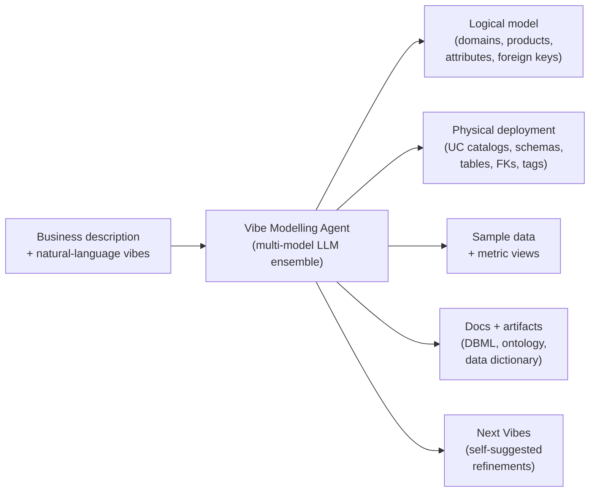
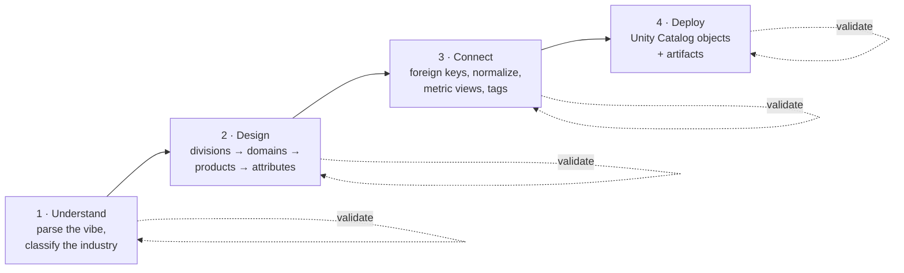
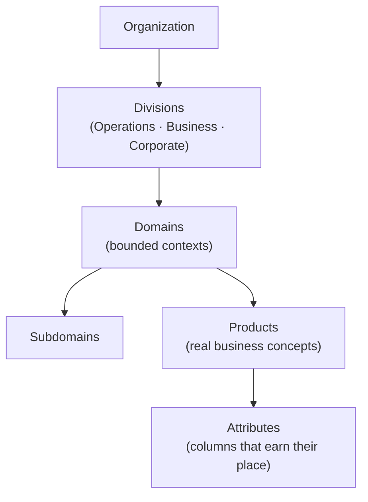
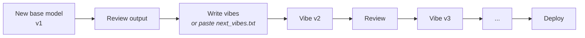

<div align="center">

# Vibe Data Modelling Agent

### Describe your business in plain English. Get a production-ready Silver-layer data model on Databricks, in hours, not months.

[](#)
[](#)
[](#)
[](#)

*Describe your business. Get a data model. Vibe it until it fits.*

---

[How to run it](#how-to-run-it) · [How it works](#how-a-vibe-becomes-a-data-model) · [What you get](#what-you-get-from-one-run) · [Scopes](#two-scopes-mvm-and-ecm) · [Vibe it](#vibe-it-until-it-fits) · [Docs](#documentation)

</div>

---

## Summary

- **Vibe Data Modelling** is a Databricks-native, LLM-powered agent that produces the analytical **Silver-layer business model** directly from a plain-English description of your business.
- From prompt to a deployed model in **hours**, replacing the six-to-thirty-six-month projects that hand-built Silver models — or the trimmed generic industry templates — have historically required.
- **Iterate in natural language:** every "vibe" produces a new versioned model, validated against enforceable rules, reviewed by two architect personas, repaired by a closed agentic loop, and redeployed to Unity Catalog. No version is ever overwritten.
- **One logical model, many physical layouts:** render the same model as one catalog, a catalog per division, or a catalog per domain. No rebuild required.

### Learn more

This is the Vibe Modeling Agent (see [`agent/dbx_vibe_modelling_agent.ipynb`](agent/dbx_vibe_modelling_agent.ipynb)): the same agent that generated every one of the published [40 Lakehouse Industry Data Models](https://github.com/amralieg/lakehouse-business-data-models). Background reading:

- [Reimagining Data Modeling on the Lakehouse: Introducing Vibe Data Modeling](https://www.databricks.com/blog/reimagining-data-modeling-lakehouse-introducing-vibe-data-modeling)
- [Jumpstart your Data Modeling with Databricks Industry Data Models](https://www.databricks.com/blog/jumpstart-your-data-modeling-databricks-industry-data-models)

---

## How to run it

Everything runs from one notebook: **`agent/dbx_vibe_modelling_agent.ipynb`**. Import it into a Databricks workspace, attach **Serverless** compute, and **run all cells top to bottom** (the notebook is split into markdown + code cells for readability — intro and widget reference at the top, pipeline code in the middle, widget registration and `main()` near the end). After the first full run, set the widgets, then run again (or submit as a Databricks job with `base_parameters`).

**Maintainers:** to regenerate the layout from the monolithic backup, run `python3 scripts/refactor_notebook_layout.py` (reads `agent/dbx_vibe_modelling_agent.ipynb.bak-layout`, writes the multi-cell notebook). Every generated code cell is syntax-checked before write.

**Prerequisites:** a Unity Catalog you can create schemas in (for physical deployment), and access to the model-serving endpoints the ensemble uses.

### 1. Build a new model (minimum widgets)

Set only these, leave everything else on its default, and run:

| Widget | Value |
|:---|:---|
| **01. Business (name)** | e.g. `Airlines` |
| **02. Description** | 2–3 sentences on what the business does |
| **03. Operation** | `new base model` |
| **03a. Run Type** | `Full Run` (default; deploys to Unity Catalog) or `Dry Run` (build the model and all volume artifacts, including the runnable `schemas/*.sql` DDL, but skip the UC deploy) |
| **05. Model Scope** | `Minimum Viable Model - MVM` (lean) or `Expanded Coverage Model - ECM` (full) |
| **09. Installation Catalog** | a UC catalog you own, e.g. `airlines_mvm_v1` (omit to produce the logical model only, no physical deploy) |

> **Notebook layout (v4.2.8+):** the first markdown cell links to the two Databricks Vibe Data Modelling blogs and the [40 Lakehouse Industry Data Models](https://www.databricks.com/blog/jumpstart-your-data-modeling-databricks-industry-data-models) repo. Widget labels in the UI match the table below.

That produces v1: the logical `model.json`, physical schemas/tables/FKs/tags, metric views, sample data, docs, and a `next_vibes.txt`.

**Dry Run vs Full Run (widget 03a).** `Full Run` (the default) deploys the model to Unity Catalog. `Dry Run` runs the entire pipeline and writes every volume artifact (`model.json`, the runnable `schemas/*.sql` and `metrics/*.sql` DDL, DBML, docs) but creates nothing in the catalog. Deploy a Dry Run output later with `install model` or the standalone installer pointed at the `model.json` path. Dry Run applies to the generative operations (`new base model`, `vibe modeling of version`, `shrink ecm`, `enlarge mvm`); `install model` and `uninstall model version` always deploy regardless of Run Type.

### 2. Every other operation (the cheat-sheet)

Same notebook — change **03. Operation** and fill the few widgets each mode needs:

| To do this | Set Operation to | Also set |
|:---|:---|:---|
| **Refine an existing version (VOV)** | `vibe modeling of version` | **04. Version** = the version to build on · **08. Model Vibes** = your changes in plain English (or paste `next_vibes.txt`). Writes a **new** version N+1; the source version is untouched. |
| **Shrink an ECM to a lean MVM** | `shrink ecm` | **04. Version** · **09. Installation Catalog** |
| **Enlarge an MVM to a full ECM** | `enlarge mvm` | **04. Version** · **09. Installation Catalog** |
| **Deploy a logical model to the catalog** | `install model` | **11. Model JSON File** (path to a `model.json`) · **09. Installation Catalog** |
| **Remove a version's physical objects** | `uninstall model version` | **01. Business** · **04. Version** · **09. Installation Catalog** |
| **Add sample rows to a deployed model** | `generate sample data` | **11. Model JSON File** · **09. Installation Catalog** · **10. Sample Records** (> 0) |

**Vibes** (widget 08) are free-form English — inline (up to 2,000 chars) or a path to a `.txt` on a UC Volume. Examples: `"Add a compliance domain with regulatory_filing and audit_trail tables"`, `"Mark all email columns as PII"`, `"Merge customer_support into the customer domain"`.

### 3. Where the outputs land

**Artifact files — on a UC Volume** under the installation catalog:

```
/Volumes/{catalog}/_metamodel/vol_root/
├── business/{business}/{scope}_v{N}/      # e.g. airlines/mvm_v1
│   ├── model.json                         # the authoritative logical model
│   ├── domains/ products/ attributes/ fk_links/
│   ├── artifacts/                         # README, Excel, DBML diagram, RDFS ontology
│   ├── samples/                           # one CSV per table
│   └── vibes/next_vibes.txt               # suggested refinements for the next run
└── logs/{business}/{scope}_v{N}/          # info + error logs for the run
```

**Model state — in the `_metamodel` schema** (query it with plain SQL):

| Table | What it holds |
|:---|:---|
| `{catalog}._metamodel.business` | one row per `(business, version, model_scope)` with run status and the result JSON |
| `{catalog}._metamodel.domain` | every domain in the model |
| `{catalog}._metamodel.product` | every product (table) |
| `{catalog}._metamodel.attribute` | every attribute (column), types, and foreign keys |

The **physical deployment** lands directly in your installation catalog: domains become **schemas**, products become **Delta tables**, attributes become **columns**, plus FK constraints, classification tags, and metric views.

> Want both ECM and MVM built and install-tested in one job? Use the **`vibe_runner`** notebook — see [Both scopes in one job](#both-scopes-in-one-job-runner-mode).

---

## The challenge with data modelling

In every analytics stack, the **Silver layer** is where it is made or broken. BI and dashboards read from Gold; Gold is built from Silver. The Silver-layer model is the foundation every analyst, data scientist, and BI tool depends on. If Silver is messy, ungoverned, or full of duplicates, everything above it gets harder, slower, and more expensive.

Getting there has always been the problem. Most organizations either spend six months to three years hand-building a Silver model from scratch, or they buy a generic industry template (ACORD for insurance, FHIR for healthcare, ARTS for retail, TM Forum SID for telecom) and then spend nine to twelve months trimming, renaming, and rewiring it. A template is the average of a whole sector: typically 20 to 40 percent is relevant, and it was built for no specific business. Neither path keeps up with how fast modern data products need to ship.

---

## Introducing Vibe Data Modelling

Vibe Data Modelling is a multi-model LLM agent that turns a plain-English description of your business into a complete, governed, deployable Silver-layer data model. It ships as a **single notebook**: four widgets, one run, a fully deployed model in Unity Catalog. If you do not like what came out, you "vibe" it in plain English until it fits.

- **Hours, not months** — a deployed Minimum Viable Model in under two hours, an Expanded Coverage Model in a single afternoon.
- **100% relevant to you** — it uses your terminology, divisions, and domains, not a sector average.
- **Trustworthy by construction** — enforceable rules, two architect reviews, and an agentic loop that proves the model before it ships.
- **Native Unity Catalog deployment** — schemas, tables, foreign keys, classification tags, metric views, an RDFS ontology, a DBML diagram, and sample data, generated and versioned together.



### User vibes are the supreme authority

One principle governs the whole agent: **what you say wins**. An explicit instruction in a widget, in `model_vibes`, or in your business description outranks every heuristic, scoring formula, gate, and LLM opinion in the pipeline. If you say "exactly 10 domains," no tier classifier may add an eleventh. If you name a domain, the model keeps it — verbatim.

The priority pyramid: **user vibes always win**; everything else exists to serve them.

1. **User vibes** — widgets, `model_vibes`, business description, any explicit directive
2. Deterministic invariants — Serverless compatibility, industry-agnostic behaviour
3. Architect review scores, quality gates, LLM recommendations
4. Best-practice heuristics — tier sizing, blacklists, defaults

---

## How a vibe becomes a data model

Behind the four widgets, the agent runs a pipeline in **four stages**: it understands your input, designs the model top-down, connects it with relationships and metrics, then deploys. Each stage validates before the next begins, so only a clean stage advances.

Underneath, it is a **multi-model ensemble**: a large thinker model handles reasoning and reviews, a large worker generates the high volume of products and attributes, smaller models handle domains, tagging, and sample data, and a judge scores competing proposals on one rubric. The roster self-heals — demoting a failing model and restoring it once healthy.



### How the model is organized

Every model follows the same shape, top to bottom: **organization → divisions → domains → subdomains → products → attributes**. At the top sit the three divisions almost every organization shares: **Operations** (what they do), **Business** (who they serve), and **Corporate** (how they work). Operations and Business are the core; Corporate is the supporting minority.

A **domain** is a bounded context that owns a distinct set of concepts. A **product** is a real business concept a domain expert would recognize (an invoice, an order) — never plumbing or analytics. Every **attribute** has to earn its place.



Balance is enforced: **Operations and Business hold at least 80% of domains; Corporate is the supporting 20% or less** — and no Corporate domain appears until Operations and Business each have at least two.

### A single source of truth, and a clean graph

Two structural guarantees keep the model coherent, and both are enforced:

- **Single source of truth (SSOT).** One concept has exactly one owning product. A customer is defined once in `customer.customer`; everyone else references it by foreign key.
- **A clean DAG.** Foreign keys point child to parent, never in a cycle. No product is left siloed, and redundant columns are normalized away when a key lands.

### The rules that make it trustworthy

The agent enforces a large catalog of rules across 20 rule groups. The structural ones are **deterministic gates that read the real model dictionary**, so they cannot be talked out of a verdict — and they run as the model is built and again at the install gate against the deployed model. The **quality score the run reports is computed from the model itself**, not from the LLM's self-assessment.

| Rule group | Representative rules |
|:---|:---|
| **Naming** | snake_case; domains singular and short; products 1–3 words, no domain prefix; FKs end with the target PK name |
| **Semantic dedup** | first-class entity test; SSOT violation detection; merge or drop on high overlap; attribute dedup |
| **FK integrity** | every FK resolves to an existing PK; no bidirectional FKs; DAG required; type compatibility |
| **Primary keys** | exactly one PK per product; consistent `{product}_id` convention; consistent PK type |
| **Normalization** | 3NF; orphaned-FK detection; denormalized-key removal when a key lands |
| **Division balance** | Ops + Business ≥ 80%; Corporate ≤ 20%; no early Corporate; canonical three-division taxonomy |
| **Data types** | Spark SQL scalar types only; no calculated/aggregate columns in Silver |
| **Tags** | classification in tags; PII gets a specific PII tag and RESTRICTED sensitivity |
| **Graph topology** | DAG enforcement; cycle detection; zero siloed tables; each domain connected |
| **Product design** | M:N junctions require real evidence; Silver-layer only; no analytics products |
| **Sample data** | exact record counts; valid FK references; realistic, regex-compliant values |
| **Descriptions** | every domain, table, and attribute description ≤ 256 characters and ending on a complete word, so it stays concise and never truncates mid-word within Unity Catalog comment limits |

### The agentic loop: generate, validate, retry differently

A single LLM pass is never trusted as final. The loop **generates one concrete attempt, validates it** against the deterministic gates and static analysis, and **on failure changes strategy rather than repeating**. Unsatisfied requirements and structural residuals (denormalized keys, cross-domain duplicates, unlinked or cyclic foreign keys) route to a **sandboxed repair step** and back through validation. A **monotonic guard** reverts any pass that makes the model worse, so it can only improve or hold.

### How a vibe is verified

When you iterate, your request is parsed into structured **verification requirements (VREQs)** — each a discrete, checkable directive. Each is applied by a sandboxed mutator and **verified independently, deterministically where possible**: the gate reads the real model and the physical Unity Catalog rather than asking an LLM whether the change happened. The run reports an **adherence score**, and anything unverified is **requeued rather than quietly dropped**.

### Two architect gates

Rules catch what is mechanically wrong; the architect gates catch what is structurally unwise.

- The **Domain Architect** reviews each domain in isolation.
- The **Global Architect** reviews the whole model for cross-domain duplicates, single-source-of-truth violations, and structural integrity.

Findings are applied automatically, tracked as landed / regressed / blocked, and the review reruns up to eight passes until clean.

---

## What you get from one run

- **A logical model (`model.json`)** with every domain, product, attribute, foreign key, and classification tag.
- **A physical deployment in Unity Catalog** — schemas, tables, foreign keys (informational), and classification tags.
- **Unity Catalog metric views** — reusable KPI definitions on the products, ready for AI/BI dashboards and Genie.
- **An RDFS ontology** for semantic tools and AI agents, and a **DBML file** for dbdiagram.io.
- **Synthetic sample data** generated against the same model, plus a full pipeline log and a **`next_vibes.txt`** file of suggested refinements.

### `model.json`: one source of truth

Everything the agent produces derives from one artifact: **`model.json`**. The physical deployment, the ontology, the DBML diagram, the metric views, the sample data, the docs, and the `next_vibes` suggestions are all generated from it. Nothing is authored twice, so the logical model and every downstream artifact can never drift apart.

| Artifact | What it is |
|:---|:---|
| `model.json` | The authoritative logical model — every downstream artifact is generated from it |
| `schemas/*.sql` | Per-domain schema DDL, catalogs, and cross-domain foreign keys |
| `diagram/*_dbml_*.txt` | DBML schema diagram (paste into dbdiagram.io) |
| `ontology/*_rdf_*.ttl` | RDF/Turtle ontology for semantic tools and agents |
| `docs/*.xlsx`, `docs/*_data_dictionary_*.txt` | Excel export and column-level data dictionary |
| `vibes/next_vibes.txt` | Self-suggested refinements for the next iteration |

### What lands in Unity Catalog

When you set a deployment catalog, **domains become schemas, products become Delta tables, attributes become columns**; foreign keys are applied as informational constraints; classification tags (PII, glossary, provenance) are applied as it builds; and **metric views** land on top.

| Object | Example |
|:---|:---|
| **Schemas** | `catalog.customer`, `catalog.sales`, `catalog.logistics` |
| **Tables** | Delta tables with all columns and correct Spark SQL types |
| **Foreign keys** | Informational FK constraints between tables |
| **Tags** | Unity Catalog tags on schemas, tables, and columns |
| **Metric views** | Reusable KPI definitions for dashboards and Genie |
| **Sample data** | Synthetic records with valid FK references |

---

## Two scopes: MVM and ECM

Most teams do not need every domain on day one, so the agent produces **two scopes from the same engine**:

- **Minimum Viable Model (MVM)** — the lean core, built first.
- **Expanded Coverage Model (ECM)** — full coverage across the whole business.

You can build either, **shrink** an ECM into an MVM, or **enlarge** an MVM into an ECM — and the shrink is LLM-guided so it protects the core products. Both scopes are governed by the same rules and architect gates.

---

## Vibe it until it fits

Refinement is where Vibe Data Modelling earns its name. **v1 is the base model and it evolves forward, never sideways**: no version is overwritten, and every iteration is auditable and reversible.

Changes come in three intent modes, all under the same rules and reviews:

- **Surgical** — fix exactly this.
- **Holistic** — apply everywhere.
- **Generative** — create something new.

Vibes are free-form natural language. The agent interprets them and translates them into concrete actions:

```
"Add a compliance domain with regulatory_filing and audit_trail tables"
"Merge the customer_support domain into the customer domain"
"The order table should have a shipping_address_id FK to the address table"
"Mark all email columns as PII"
"Normalize the order domain to 3NF"
"Make this model ECM — I need the large version"
```



### One agent, many operations

The same notebook does more than build a first model. The **operation** widget selects the mode — all sharing the same rules, architect gates, and agentic loop.

| Operation | Purpose |
|:---|:---|
| **`new base model`** | Generate a brand-new data model from scratch |
| **`vibe modeling of version`** | Apply natural-language instructions to refine an existing version |
| **`shrink ecm`** | Convert an ECM to a leaner MVM (LLM-guided; protects the core) |
| **`enlarge mvm`** | Expand an MVM into a comprehensive ECM |
| **`install model`** | Deploy a logical model into physical Unity Catalog objects |
| **`uninstall model version`** | Remove a version's physical artifacts from the catalog |
| **`generate sample data`** | Generate synthetic records for a deployed model |

### How to vibe a version

To vibe an existing version, select the **"vibe modeling of version"** operation, point it at the version to build on, and write your changes in plain English (or paste the suggestions from `next_vibes.txt`). The agent parses them into VREQs, reruns the pipeline on top of that version, and writes a **new numbered version**; the one you started from is untouched.

---

## One logical model, many physical layouts

The logical model is one artifact; the **physical layout is a separate decision** controlled by a single widget. The same model can be rendered as:

- **One catalog** — the whole model in a single Unity Catalog.
- **A catalog per division** — Operations, Business, and Corporate each isolated.
- **A catalog per domain** — maximum isolation for strict governance.

If your governance reality changes, you redeploy to a different convention; the **logical model is unchanged**.

---

## Industry templates are not enough

The argument for a generic template was always the head start. The reality, learned the hard way, is that the head start costs nine to twelve months of fitting and renaming. A template is the average model for a sector; by construction it is nobody's actual business. Vibe Data Modelling produces a model in **your** terminology, with **your** divisions and domains, generated in hours and validated by the same rules every other model is.

---

## Example models built with the agent

The same industry-agnostic agent has produced full-business Expanded Coverage Models across very different sectors, each referencing the recognized standards for its industry. The published reference models live in the open-source repository:

**[github.com/amralieg/lakehouse-business-data-models](https://github.com/amralieg/lakehouse-business-data-models)** — reference MVM and ECM models across telecom, airlines, retail, healthcare, manufacturing, and more.

### Viewing a model

Once the agent has produced a model, you can explore it in the **model-viewer Databricks App** (an interactive entity-relationship graph) or load `model.json` programmatically.

**1. Full-model overview** — every entity on a single canvas, FK relationships drawn between them, domains colour-coded:


**2. Domain drill-down** — click any domain to zoom in on its subdomains and products, with the FK web restricted to within-domain links:


**3. Single-product radial view** — click any product to centre it; every related product fans out around it, grouped by domain:


Prefer code? Load the model directly:

```python
import json
m = json.load(open('<industry>/mvm_v1/model.json'))['model']
for d in m['domains']:
    for p in d.get('products', []):
        fks = sum(1 for a in p['attributes'] if a.get('foreign_key_to'))
        print(f"{d['name']}.{p['name']}: {len(p['attributes'])} columns, {fks} FKs")
```

---

## Available today

The reference implementation is a **single Databricks notebook** at `agent/dbx_vibe_modelling_agent.ipynb`. Fill in a handful of core widgets and run; everything else defaults from your industry. For the minimum inputs and the per-operation cheat-sheet, see [How to run it](#how-to-run-it) at the top. Runs on **Databricks Serverless** with **Unity Catalog** governance.

### Both scopes in one job (runner mode)

When you want **both** ECM and MVM produced and installed in one go — plus a staging round-trip to prove the install works before landing in the permanent catalogs — use the **`vibe_runner`** notebook. It launches a four-task Databricks Job: ECM generate → ECM install, MVM shrink → MVM install (the two installs run once their upstream task is done). See [`runner/readme.md`](runner/readme.md) for the file format and submit recipe.

### Full control (every widget)

The notebook exposes fine-grained widgets for naming conventions, tag prefixes, sample-data volume, physical layout, and install behaviour. The core inputs:

| # | Widget | Mandatory | Description |
|:---:|:---|:---:|:---|
| 01 | **Business (name)** | Yes | Your business/organization name |
| 02 | **Description** | Recommended | What your business does — richer input, richer model |
| 03 | **Operation** | Yes | Pipeline operation (see table above) |
| 04 | **Version** | Conditional | Version to build on (for vibe/shrink/enlarge/install) |
| 05 | **Model Scope** | Yes | MVM (lean) or ECM (comprehensive) |
| 06 | **Business Domains** | No | Comma-separated seed domains — kept verbatim if you set them |
| 07 | **Included Org Divisions** | Yes | Operations / Operations and Business / all three |
| 08 | **Model Vibes** | Conditional | Natural-language instructions — inline text or a path to a `.txt` on a UC Volume |
| 09 | **Installation Catalog** | Conditional | Unity Catalog target for physical deployment |
| 09a | **Cataloging Style** | No | Physical catalog layout: `One Catalog` (whole model in one), `Catalog per Division`, or `Catalog per Domain` |
| 10 | **Sample Records** | No | Synthetic records per table (0 = none) |
| 11 | **Model JSON File** | Conditional | Path to a previously generated `model.json` for re-install or continuation |

---

## Documentation

| Document | Description |
|:---|:---|
| [docs/](docs/readme.md) | Documentation index |
| [docs/whitepaper.md](docs/whitepaper.md) | The full technical treatment: every pipeline stage, the complete rule catalog, the architect-review methodology, and the ensemble architecture |
| [docs/design-guide.md](docs/design-guide.md) | Technical design reference |
| [docs/integration-guide.md](docs/integration-guide.md) | UI / consumer integration protocol |
| [docs/quality-gates.md](docs/quality-gates.md) | The deterministic quality-gate catalog |
| [runner/readme.md](runner/readme.md) | Pipeline orchestrator guide |
| [tests/readme.md](tests/readme.md) | Test-suite reference |

If your team has been carrying a Silver-layer project for months without shipping, this is the shortest path we have found to actually shipping one. Describe your business in plain English, get a model, iterate until it fits, and put it into production.

---

## Legal Information

**Use at your own risk.**

This software is provided as-is and is not officially supported by Databricks through customer technical support channels. Support, questions, and feature requests can be communicated through the Issues page of this repo. Issues with the use of this code will not be answered or investigated by Databricks Support.

---

<div align="center">

*Built on Databricks Serverless Compute with Unity Catalog governance*

</div>
